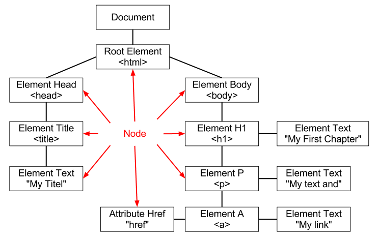

# DOM

Document Object model. It allow us use Javascript to ACCECC HTML elements and styles in order to manipulate them.

It's the connection point of HTML and JS code.

Tree structure, generated by browser on html load



- e.g. Change text

- Change html attributes

- Change CSS

`document.querySelector();`

- This is a method. Of document object.

- Whatever in the HTML also has to be in the DOM tree.

# Technical Term: DOM

Javascript interact with a webpage = Doing DOM Manipulation

DOM and DOM Methods/Properties are not part of JS or ES. It's a part of something called web APIs. Which we can access from js code.

# Technical Term: API

WEB APIs are basicly libraries that are also written in JS and are automaticlly available for us to use (We don't have to import)

Besides DOM, There are actully a ton more APIs, such as fetch, timer.

# DOM Test

```javascript
"use strict";
// look what I get here  console.log(document.querySelector('.message'));
// console.log(document.querySelector('.message'));
// or document.querySelector('#message');

console.log(document.querySelector(".message").textContent);
// we select the element, and then from that element we select the property. which is textcontent.

document.querySelector(".message").textContent = "Im HERE !!";
// I change the content!

document.querySelector(".number").textContent = "999";

document.querySelector(".guess").value = 23;
console.log(document.querySelector(".guess").value);
```

# Event listener

Event: Something happen on the page.

First: Select where the event should happen.

# manipulate with class

In eventlistener syntex. We don't use colosemodal(), this parantensec() will immdiataly call the function.

```javascript
const modal = document.querySelector(".modal");
const overlay = document.querySelector(".overlay");
const btnCloseModal = document.querySelector(".close-modal");
const btnsShowModal = document.querySelectorAll(".show-modal");

const closeModal = function () {
  modal.classList.add("hidden");
  overlay.classList.add("hidden");
};
const openModal = function () {
  modal.classList.remove("hidden");
  overlay.classList.remove("hidden");
};

for (let i = 0; i < btnsShowModal.length; i++) {
  btnsShowModal[i].addEventListener("click", openModal);
}
btnCloseModal.addEventListener("click", closeModal);
overlay.addEventListener("click", closeModal);
// we don't use closemodal(), it will call the function

document.addEventListener("keydown", function (e) {
  if (e.key === "Escape" && !modal.classList.contains("hidden")) {
    closeModal();
  }
});
```
