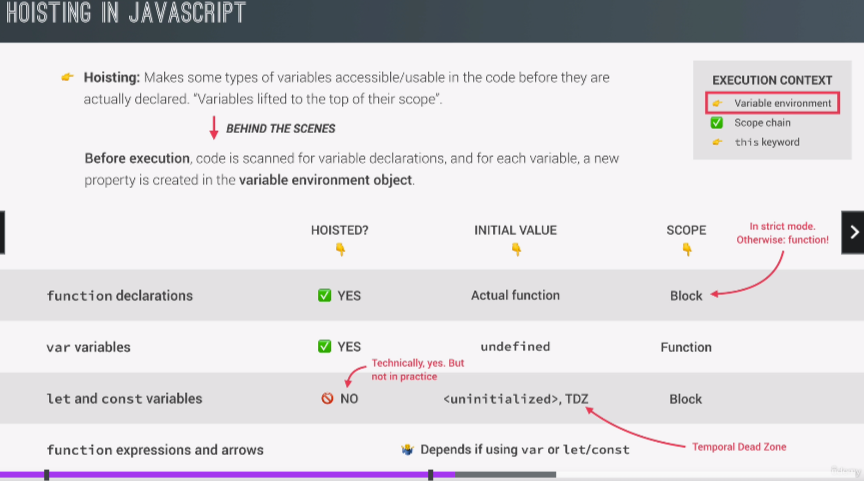

# HOISTING & TDZ (temporal dead zone)

---

# WHY HOISTING & TDZ

# CONCLUSION

- NEVER USE VAR
- DECLARE YOUR VARIABLES AT THE FRONT OF A SCOPE. (LESS TDZ)
- DECLARE FUNCTION (EVEN FUNCTION DECLARATIONS AT THE FRONT).

# BONUS: WHAT IS GLOBAL WINDOW OBJECT?
