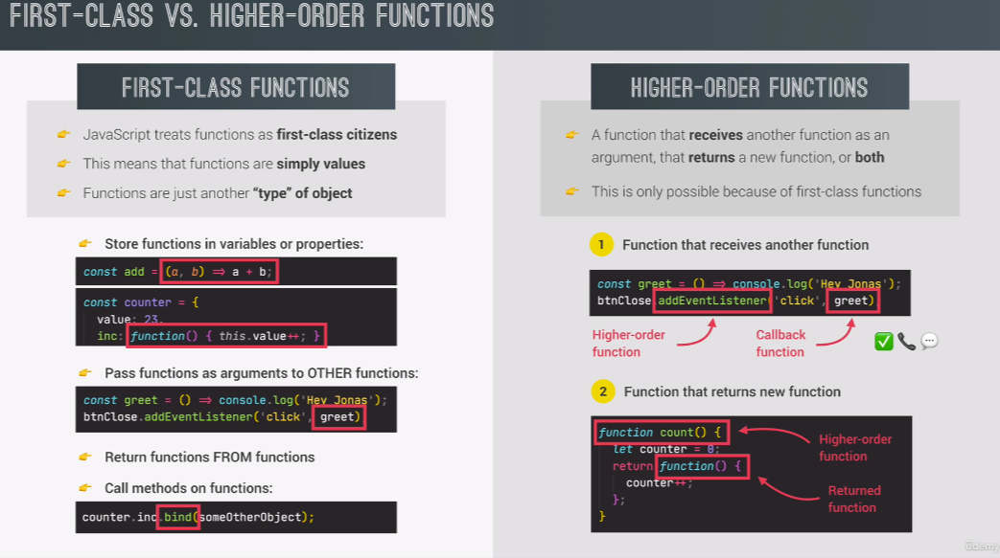

# FUNCTION 2

## Default Parameters

- example

  ```javascript
  const creatBooking = function (
    flightNum,
    numPassengers = 1,
    price = numPassengers * 200
  ) {
    // ES5 way of default parameters
    // numPassengers = numPassengers || 1;
    // price = price || 199;
    const bookingObj = {
      flightNum,
      numPassengers,
      price,
    };
    console.log(bookingObj); // {flightNum: 'whatever', numPassengers: 1, price: 200}
  };
  creatBooking("whatever", undefined, undefined);
  ```

## How Passing Arguments Works: Value vs. Reference

- Example 1: Change Parametered OBJs.

  ```javascript
  const flight = "LH234";
  const torin = {
    name: "Torin Zhou",
    passport: 123456,
  };
  const checkIn = function (flightNum, passenger) {
    // do a strange change
    flightNum = "MH333";
    passenger.name = "Mr. " + passenger.name;
    if (passenger.passport === 123456) {
      console.log("Check in");
    } else {
      alert("Wrong passport");
    }
  };
  console.log(flight); // LH234
  console.log(torin); // {name: 'Torin Zhou', passport: 123456}
  checkIn(flight, torin);
  console.log(flight); // LH234
  console.log(torin); // {name: 'Mr. Torin Zhou', passport: 123456}
  // primitive are totally different copies, in arguments.
  // when pass to functions: objs are references. point to the same obj.
  // whatever we change the arguments reference, it will affect the original.
  ```

- Example 2: Two function manipulate the same OBJ.

  ```javascript
  const newPassport = function (person) {
    person.passport = math.trunc(Math.random() * 10000000);
  };
  newPassport(torin);
  checkIn(flight, torin); // wrong password
  ```

- Passing by Value/Reference
  <pre>
  JavaScrip does not has passing by Reference. 
  The reference we pass 'Torin', is still a value</pre>

## First-Class and Higher-Order Functions

- FirstClass Function is Just a Concept
  - Meaning JS Functions are value, nothing more
- While Higher-Order is a practice
  

## Functions Accepting Call back Functions

- Example 1: Callback function(function with out (parameter))

  ```javascript
  const oneWord = function (str) {
    return str.replaceAll(" ", "").toLowerCae();
  };
  const upperFirstWord = function (str) {
    const [first, ...others] = str.split(" ");
    return [first.toUpperCase(), ...others].join(" ");
  };
  // Higher-Order Function
  const transformer = function (str, fn) {
    // fn is callback function. transformer()is higher order function
    console.log(`Original String: ${str}`);
    console.log(`Transfored string: ${fn(str)}`);
    console.log(`Transforemd by: ${fn.name}`); // fn also has method
  };
  transformer("JS is the best", upperFirstWord); // only passing the function value. not calling it right now.
  ```

## Functions Returning Functions

- Example
  ```javascript
  const greet = function (greeting) {
    return function (name) {
      console.log(`${greeting}${name}`);
    };
  };
  greet("Hello")("Torin");
  // rewrite in arr function
  const greetArr = (greeting) => (name) => console.log(`${greeting}${name}`);
  ```

## The call and aplly Methods

- Example 1

  ```javascript
  const lufthansa = {
    airline: "Lufthansa",
    iataCode: "LH",
    bookings: [],
    // book : function(flightNum) {
    // (enhanced mothod iteral)}
    book(flightNum, name) {
      console.log(
        `${name} booked a seat on ${this.airline} flight ${this.iataCode}${flightNum}`
      );
      this.bookings.push({
        flight: `${this.iataCode}${flightNum}`,
        name,
      });
    },
  };
  const eurowings = {
    airline: "Eurowings",
    iataCode: "EW",
    bookings: [],
  };
  const swiss = {
    airline: "Swiss Aie Lines",
    iataCode: "LX",
    bookings: [],
  };
  lufthansa.book(222, "Torin");
  console.log(lufthansa.bookings);
  const book = lufthansa.book;
  book.call(lufthansa, 223, "Torin");
  book.call(eurowings, 223, "Torin");
  ```

## The bind MeThod

- BIND METHOD

  ```javascript
  const bookEU = book.bind(eurowings);
  bookEU(24, "Kobe Byrant");
  // Kobe Byrant booked a seat on Eurowings flight EW24
  const bookEU23 = book.bind(eurowings, 23);
  // this is so-called partial application
  bookEU23("Torin");
  // Torin booked a seat on Eurowings flight EW23
  ```

- WITH EVENT LISTENERS

  ```javascript
  lufthansa.planes = 300;
  lufthansa.buyPlane = function () {
    console.log(this);
    this.planes++;
    console.log(this.planes);
  };
  document.querySelector(".buy").addEventListener("click", lufthansa.buyPlane);
  // <button class="buy"> Buy new plane </button>
  // NaN
  document
    .querySelector(".buy")
    .addEventListener("click", lufthansa.buyPlane.bind(lufthansa));
  // {airline: 'Lufthansa', iataCode: 'LH', bookings: Array(2), planes: 300, book: ƒ, …}
  // 301
  ```

- Partial application (general functions no this)

  ```javascript
  const addTax = (rate, value) => value + value * rate;
  console.log(addTax(0.1, 100));
  console.log(addTax.this); // undefine
  const addVAT = addTax.bind(null, 0.23);
  // REWRITE USING RETURNED FUNCTION
  const addTax2 = function (rate) {
    return function (value) {
      return value + value * rate;
    };
  };
  const addVAT2 = addTax2(0.23);
  addVAT2(200);
  ```

## Coding Challenge #1

- Example 1

  ```javascript
  const poll = {
    question: "What is your favourite programming language?",
    options: ["0: JavaScript", "1: Python", "2: Rust", "3:C++"],
    answers: new Array(4).fill(0),
    registerNewAnswer() {
      let answer = prompt(`${this.question}?\n${this.options.join("\n")}`);
      if ([0, 1, 2, 3].includes(Number(answer))) {
        this.answers[answer]++;
      }
      this.displayResults.bind(poll)();
    },
    displayResults(type = "string") {
      type = prompt("Which type of reuslt would you like to check? ");
      if (type === "string" || type === "")
        return console.log(`Poll results are ${this.answers}`);
      if (type === "array") return console.log(this.answers);
    },
  };
  document
    .querySelector(".poll")
    .addEventListener("click", poll.registerNewAnswer.bind(poll));
  ```

## Immediately Invoked Function Expression (IIFE)

- Example 1

  ```javascript
  const runOnce = function () {
    console.log("This can be run over and over again");
  };
  (function () {
    console.log("This will never run again");
  })();
  (() => console.log("This arrFunction will never run again"))();
  ```

## Closures

- Example 1

  ```javascript
  const secureBooking = function () {
    let passengerCount = 0;

    return function () {
      passengerCount++;
      console.log(`${passengerCount}`);
    };
  };
  const booker = secureBooking();
  booker();
  booker();
  booker();
  ```

- What is Closure
  

## More Closure Examples

- Example 1

```javascript
const bookEU = book.bind(eurowings);
bookEU(24, "Kobe Byrant");
// Kobe Byrant booked a seat on Eurowings flight EW24
```

## Coding Challenge #2

- challenge 1

  ```javascript
  let showDetail;
  (function () {
    const header = document.querySelector("h1");
    header.style.color = "red";
    const changeColor = function () {
      header.style.color = "blue";
    };
    document.querySelector("body").addEventListener("click", changeColor);
    console.dir(changeColor); //sucessiful run
    showDetail = function () {
      console.dir(changeColor);
    };
  })();
  showDetail(); // sucessiful run
  console.dir(changeColor); // undefine
  ```

  > 1. After the IFEE excution, changeColor function was attached to the body Elemnent, and live somewhere in the code. Because it was declared inside the IIFE. So it has the closure of the header element. Whether or not if IIFE was alive dosen't matter.
  > 2. showDetail was declared outside tht function, but the function which it was referencing to was declared in the IIFE, that function close over(has the closure) of the header element
