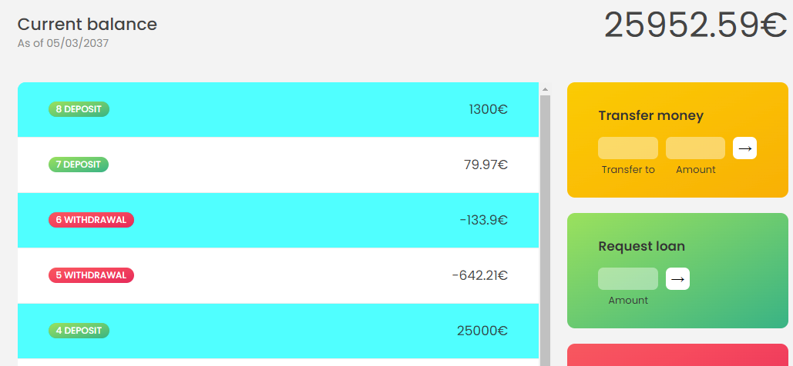
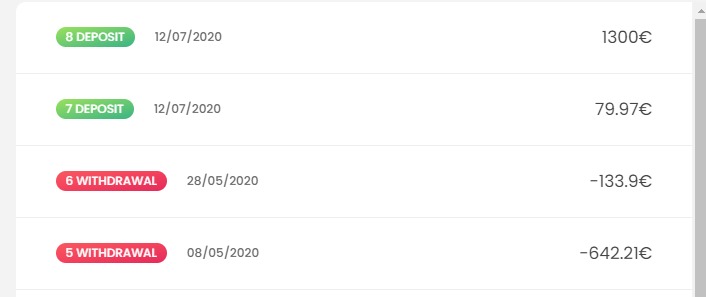
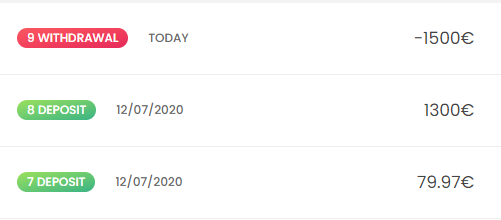

# NUMBERS, DATES, INTL AND TIMERS

## Numbers (Section 170 2021.12.20)

- 1. Basic 🎉🎉🎉

  ```javascript
  console.log(23 === 23.0);
  //true
  console.log(0.1 + 0.2);
  // 0.3000000000004
  console.log(0.1 + 0.2 === 0.3);
  // false
  ```

- 2. Type coercion 🎉🎉🎉

  ```javascript
  console.log(+`23`);
  console.log(Number(`23`));
  ```

- 3. Number.parseInt() Number.parseFloat() 🎉🎉🎉

  ```javascript
  console.log(Number.parseInt(`30px`, 10));
  // 30rem => 30
  console.log(Number.parseInt(`1Fpx`, 16));
  // 31 ????
  console.log(Number.parseInt(`17px`, 8));
  // 15 ???
  console.log(Number.parseInt(`111px`, 2));
  // 7
  console.log(Number.parseInt(`px30`, 10));
  // NaN
  console.log(Number.parseInt(`   2.5rem`));
  // 2 (blocks won't count)
  console.log(Number.parseFloat(`    2.5rem`));
  // 2.5
  ```

- 4. Number.isNaN() 🎉🎉🎉

  > (true: number && NaN) (false:else)

  > Check if value is NaN (literally NaN)

  ```javascript
  (20 / 0); // Infinity
  (0 / 0); // NaN

  (+`23whatever`); // NaN
  (typeof (20 / 0)); // number Infinity
  (typeof (0 / 0)); // number NaN
  (typeof NaN); // number
  (typeof +`23whatever`); // number

  isNaN('hello world');        // true
  Number.isNaN('hello world'); // false

  (Number.isNaN(20); // false
  (Number.isNaN(20 / 0); // false number but not a NaN
  (Number.isNaN(0 / 0); // true
  (Number.isNaN(NaN); // true

  let num = +prompt("Enter a number", '');
  // will be true unless you enter Infinity, -Infinity or not a number
  alert( isFinite(num) );
  ```

  > Please note that an empty or a space-only string is treated as 0 in all numeric functions including isFinite.

- 5. Number.isFinite() 🎉🎉🎉

  > Best way to check if a value is a number.

  ```javascript
  Number.isFinite(20); // true
  Number.isFinite(`20`); // false
  Number.isFinite(+`20`); // true
  Number.isFinite(23 / 0); // false
  ```

- 6. Number.isInteger() 🎉🎉🎉

  > Check Integer

  ```javascript
  console.log(Number.isInteger(23)); // true
  console.log(Number.isInteger(23.0)); // true
  console.log(Number.isInteger(23 / 0)); // false
  ```


# Math and Rounding

- square root

  ```javascript
  console.log(Math.sqrt(25)); // 5
  console.log(25 ** (1 / 2)); // 5
  console.log(8 ** (1 / 3)); // 2
  console.log(Math.max(5, 18, `23`, 11, 2)); // 23
  console.log(Math.max(5, 18, `23px`, 11, 2)); // NaN
  console.log(Math.min(1, 2, 3, 4));
  console.log(Math.PI * Number.parseFloat(`10px`) ** 2);
  console.log(Math.trunc(Math.random() * 6) + 1); // 1~6
  const randomInt = (min, max) =>
    Math.floor(Math.random() * (max - min) + 1) + min;
  console.log(randomInt(1, 5)
  ```

- Roundiung Integers

  ```javascript
  Math.trunc(-22.9); // -22
  Math.floor(-22.9); // -23
  Math.ceil(22.2);
  Math.round(22.3);
  ```

- Rounding decimals

  ```javascript
  (2.7).toFixed(3); //  return a string 2.700
  ```

  

# REMINDER

- Usage 1 : Do something every Nth time.

  ```javascript
  labelBalance.addEventListener("click", function () {
    const arr = document.querySelectorAll(".movements__row");
    console.log(arr); //  NodeList(8)
    console.log(...arr);
    console.log([...arr]); // convert NodeList(8)  to real Array(8)
    [...document.querySelectorAll(".movements__row")].forEach(function (
      row,
      i
    ) {
      if (i % 2 === 0) row.style.backgroundColor = "cyan";
    });
  });
  ```

  

# ES2021: Numeric Separators

- example
  ```javascript
  const diameter = 287_460_000_000; // 287,460,000,000
  const priceInCents = 345_99; // 345.99 $ = 34599 cents
  const transferFee1 = 15_00;
  const transferFee2 = 1_500; // two same number
  console.log(Number("23_000")); // NaN
  console.log(parseInt("23_000")); // 230
  ```

# ES2020: Bigint

> 64bits: 53bits to store the number itself, while the rest bits will be used to store the decima and sign.

```javascript
// before ES2020
console.log(2 ** 53 - 1); // 9007199254740991
console.log(Number.MAX_SAFE_INTEGER); // 9007199254740991
console.log(2 ** 53 + 100); // 9007199254741092
```

```javascript
console.log(467373838383838383838473877777773333333);
// 4.673738383838384e+38 loose precise
console.log(467373838383838383838473877777773333333n);
// 467373838383838383838473877777773333333n
console.log(BigInt(467373838383838383838473877777773333333));
// 467373838383838377927141645154082881536n;
console.log(12345n ** 9n);
// 6659166111488656281486807152009765625n
// notice that we cannot mix BigInt and other type. (expect logical)
// like 12345n ** 9 => error
(20n === 20)(
  // false different primitive type
  20n == 20
); // true (type corcion)
```

```javascript
console(10n / 3n); // 3n
console(10 / 3); // 3.33333333335
```


# Data() Time()

- Date()

  ```javascript
  const now = new Date();
  console.log(now);
  // Tue Dec 21 2021 03:39:28 GMT+0800 (中国标准时间)
  console.log(new Date(account1.movementsDates[0]));
  console.log(new Date(2077, 0, 35));
  // Thu Feb 04 2077 00:00:00 GMT+0800 (中国标准时间)
  console.log(new Date(0));
  // Thu Jan 01 1970 08:00:00 GMT+0800 (中国标准时间)
  // this 1970 is Initial Unix time
  new Date(3 * 24 * 60 * 60 * 1000);
  // 3 day after unix 0  1970.1.4
  ```

  [Initial Unix Time](https://unix.stackexchange.com/questions/26205/why-does-unix-time-start-at-1970-01-01)

- Date() method

  ```javascript
  const future = new Date(2037, 10, 19, 15, 23);
  console.log(future);
  console.log(future.getFullYear()); // 2037
  console.log(future.getMonth()); // 10 : Nov
  console.log(future.getDate()); // 19
  console.log(future.getDay()); // 4 : Thusday
  console.log(future.getHours()); // 4 : Thusday
  console.log(future.getMinutes()); //
  console.log(future.getSeconds()); //
  console.log(future.getSeconds()); //
  console.log(future.toISOString()); // 2037-11-19T07:23:00.000Z
  console.log(future.getTime());
  // 2142228180000  milisecond after unix 0
  console.log(new Date(2142228180000));
  // future
  console.log(Date.now()); // 1640030844753 now
  future.setFullYear(2040); // 2040
  ```

  > [ISO 8601: https://en.wikipedia.org/wiki/ISO_8601#Times](https://en.wikipedia.org/wiki/ISO_8601#Times)

- Date() in our Bankit APP

  ```javascript
  const displayMovements = function (acc, sort = false) {
    containerMovements.innerHTML = "";

    const movs = sort
      ? acc.movements.slice().sort((a, b) => a - b)
      : acc.movements;

    movs.forEach(function (mov, i) {
      const type = mov > 0 ? "deposit" : "withdrawal";

      const date = new Date(acc.movementsDates[i]);
      const day = `${date.getDate()}`.padStart(2, 0);
      const month = `${date.getMonth() + 1}`.padStart(2, 0);
      const year = date.getFullYear();
      const displayDate = `${day}/${month}/${year}`;
      console.log(displayDate);

      const html = `
        <div class="movements__row">
          <div class="movements__type movements__type--${type}">${
        i + 1
      } ${type}</div>
          <div class="movements__date">${displayDate}</div>
          <div class="movements__value">${mov}€</div>
        </div>
      `;

      containerMovements.insertAdjacentHTML("afterbegin", html);
    });
  };
  ```

  

  ```javascript
  const now = new Date();
  const day = `${now.getDate()}`.padStart(2, "0");
  const month = `${now.getMonth() + 1}`.padStart(2, "0");
  const year = now.getFullYear();
  const hour = now.getHours();
  const min = now.getMinutes();
  labelDate.textContent = `${day}/${month}/${year},${hour},${min}`;
  ```

  

  ```javascript
  // add transfer/loan date
  currentAccount.movementsDates.push(new Date().toISOString());
  receiverAcc.movementsDates.push(new Date().toISOString());
  // its OK without isostring but will get an obj
  // but that's ok
  ```

  

# Calc DataPassed

- In bankist

```javascript
const formatMovementDate = function (date) {
  const calcDaysPassed = (date1, date2) =>
    Math.round(Math.abs(date2 - date1) / 1000 / 60 / 60 / 24);
  const daysPassed = calcDaysPassed(new Date(), date);

  if (daysPassed === 0) return `Today`;
  if (daysPassed === 1) return `Yesterday`;
  if (daysPassed <= 7) return `${daysPassed} days age`;
  const day = `${date.getDate()}`.padStart(2, 0);
  const month = `${date.getMonth() + 1}`.padStart(2, 0);
  const year = date.getFullYear();
  return `${day}/${month}/${year}`;
};

const displayMovements = function (acc, sort = false) {
  containerMovements.innerHTML = "";

  const movs = sort
    ? acc.movements.slice().sort((a, b) => a - b)
    : acc.movements;

  movs.forEach(function (mov, i) {
    const type = mov > 0 ? "deposit" : "withdrawal";
    const date = new Date(acc.movementsDates[i]);
    const displayDate = formatMovementDate(date);
    const html = `
      <div class="movements__row">
        <div class="movements__type movements__type--${type}">${
      i + 1
    } ${type}</div>
        <div class="movements__date">${displayDate}</div>
        <div class="movements__value">${mov}€</div>
      </div>
    `;

    containerMovements.insertAdjacentHTML("afterbegin", html);
  });
};
```


# [Date Localized](https://developer.mozilla.org/en-US/docs/Web/JavaScript/Reference/Global_Objects/Intl)

```javascript
btnLogin.addEventListener("click", function (e) {
  // Prevent form from submitting
  e.preventDefault();
  currentAccount = accounts.find(
    (acc) => acc.username === inputLoginUsername.value
  );
  if (currentAccount?.pin === +inputLoginPin.value) {
    // Display UI and message
    labelWelcome.textContent = `Welcome back, ${
      currentAccount.owner.split(" ")[0]
    }`;
    containerApp.style.opacity = 100;
    // current date
    const now = new Date();
    const options = {
      hour: "numeric",
      minute: "numeric",
      day: "numeric",
      month: "long",
      year: "numeric",
      // weekday: 'long',
    };
    const locale = navigator.language;
    labelDate.textContent = new Intl.DateTimeFormat(
      currentAccount.locale,
      options
    ).format(now);
    inputLoginUsername.value = inputLoginPin.value = "";
    inputLoginPin.blur();
    // Update UI
    updateUI(currentAccount);
  }
});
```


```javascript
const formatMovementDate = function (date, locale) {
  const calcDaysPassed = (date1, date2) =>
    Math.round(Math.abs(date2 - date1) / 1000 / 60 / 60 / 24);
  const daysPassed = calcDaysPassed(new Date(), date);
  if (daysPassed === 0) return `Today`;
  if (daysPassed === 1) return `Yesterday`;
  if (daysPassed <= 7) return `${daysPassed} days age`;
  return new Intl.DateTimeFormat(locale).format(date);
};
const displayMovements = function (acc, sort = false) {
  containerMovements.innerHTML = "";
  const movs = sort
    ? acc.movements.slice().sort((a, b) => a - b)
    : acc.movements;
  movs.forEach(function (mov, i) {
    const type = mov > 0 ? "deposit" : "withdrawal";
    const date = new Date(acc.movementsDates[i]);
    const displayDate = formatMovementDate(date, acc.locale);
    const html = `
      <div class="movements__row">
        <div class="movements__type movements__type--${type}">${
      i + 1
    } ${type}</div>
        <div class="movements__date">${displayDate}</div>
        <div class="movements__value">${mov}€</div>
      </div>
    `;
    containerMovements.insertAdjacentHTML("afterbegin", html);
  });
};
```



# IntlNumberFormat

```javascript
const formatCur = function (value, locale, currency) {
  return new Intl.NumberFormat(locale, {
    style: `currency`,
    currency: currency,
  }).format(value);
};
```

```javascript
const calcDisplayBalance = function (acc) {
  acc.balance = acc.movements.reduce((acc, mov) => acc + mov, 0);
  labelBalance.textContent = formatCur(acc.balance, acc.locale, acc.currency);
};

const calcDisplaySummary = function (acc) {
  const incomes = acc.movements
    .filter((mov) => mov > 0)
    .reduce((acc, mov) => acc + mov, 0);
  labelSumIn.textContent = formatCur(acc.balance, acc.locale, acc.currency);

  const out = acc.movements
    .filter((mov) => mov < 0)
    .reduce((acc, mov) => acc + mov, 0);
  labelSumOut.textContent = formatCur(out, acc.locale, acc.currency);

  const interest = acc.movements
    .filter((mov) => mov > 0)
    .map((deposit) => (deposit * acc.interestRate) / 100)
    .filter((int, i, arr) => {
      // console.log(arr);
      return int >= 1;
    })
    .reduce((acc, int) => acc + int, 0);
  labelSumInterest.textContent = formatCur(interest, acc.locale, acc.currency);
};
```


# Timer $ Interal

- basic 1

  ```javascript
  setTimeout(() => console.log("Here is your pizza"), 3000);
  console.log("This lines showing up means Asynchronous JS");
  ```

- basic 2 (pass arguments)

  ```javascript
  setTimeout(
    (ing1, ing2) => console.log(` ${ing1} and ${ing2} `),
    3000,
    "olives",
    "spinach"
  );
  ```

- basic 3 (cancel the timeout)

  ```javascript
  const ingredients = ["olives", "spinach"];
  const pizzaTimer = setTimeout(
    (ing1, ing2) => console.log(` ${ing1} and ${ing2}`),
    5000,
    ...ingredients
  );
  if (ingredients.includes("spinach")) clearTimeout(pizzaTimer);
  ```

- basic 4 (Interal)

  ```javascript
  setInterval(function () {
    const now = new Date();
    const hour = now.getHours();
    const min = now.getMinutes();
    const sec = now.getSeconds();
    console.log(`${hour}:${min}:${sec}`);
  }, 1000);
  ```

- bankist

  ```javascript
  let timer;
  const startLogOutTimer = function () {
    let time = 11;
    const tick = function () {
      const min = String(Math.trunc(time / 60)).padStart(2, "0");
      const sec = String(time % 60).padStart(2, "0");
      labelTimer.textContent = `${min}:${sec}`;
      if (time === 0) {
        clearInterval(timer);
        labelWelcome.textContent = `Login Please
      `;
        containerApp.style.opacity = 0;
      }
      time--;
    };
    tick();
    timer = setInterval(tick, 1000);
    return timer;
  };
  // ....  🎉code blow is the login section check.
  if (timer) clearInterval(timer);
  startLogOutTimer();
  updateUI(currentAccount);
  ```
