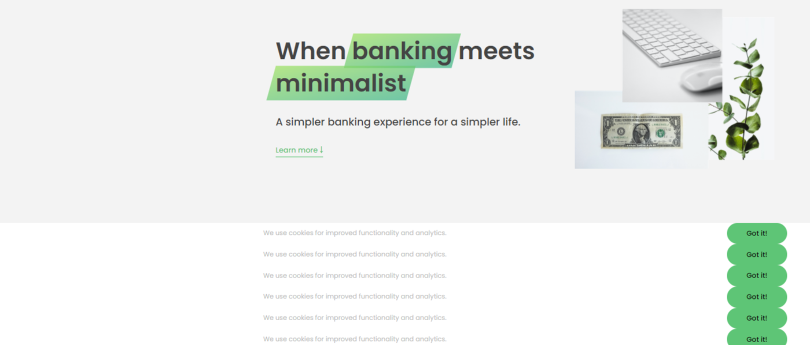

# ADVANCED DOM

## 1. Select Elements

- example

  ```javascript
  console.log(document); // prototype: HtmlDocumnent
  console.log(document.documentElement); // prototype: HTMLElement
  console.log(document.head);
  console.log(document.body);

  document.querySelector(".header");
  const allSections = document.querySelectorAll(".section");
  console.log(allSections); //  return nodelist (Won't update itself)

  document.getElementById("section--1");
  const allButtons = document.getElementsByTagName("button");
  console.log(allButtons); // return HTML-Collection(updates automaticlly E.g: Delete an element)

  document.getElementsByClassName("btn");
  ```

- [HTMLCollection vs NodeList](https://dev.to/jharteaga/difference-between-htmlcollection-and-nodelist-25bp?signin=true)

  > getElementsByClassName() returns a live HTMLCollection representing an array-like object of all child elements which have all of the given class name(s).

  > querySelectorAll() returns a static (not live) NodeList representing a list of the document's elements that match the specified group of selectors.

- [Document](https://developer.mozilla.org/en-US/docs/Web/API/Document)
  > The Document interface represents any web page loaded in the browser and serves as an entry point into the web page's content, which is the [DOM tree](https://developer.mozilla.org/en-US/docs/Web/API/Document_object_model/Using_the_W3C_DOM_Level_1_Core).
- [Document.documentElement](https://developer.mozilla.org/en-US/docs/Web/API/Document/documentElement)

  > Document.documentElement returns the Element that is the root element of the document (for example, the <html> element for HTML documents).

  ```javascript
  const rootElement = document.documentElement;
  const firstTier = rootElement.childNodes;
  // firstTier is a NodeList of the direct children of the root element
  // such as <head> and <body>

  for (const child of firstTier) {
    // do something with each direct child of the root element
  }
  ```

  

## 2. Creating and inserting elements

- Confusing Conceptions

  - [Element.insertAdjacentHTML()](https://developer.mozilla.org/en-US/docs/Web/API/Element/insertAdjacentHTML)

    > The insertAdjacentHTML() method of the Element interface parses the specified text as HTML or XML and inserts the resulting nodes into the DOM tree at a specified position. It does not reparse the element it is being used on, and thus it does not corrupt the existing elements inside that element. This avoids the extra step of serialization, making it much faster than direct innerHTML manipulation.

  - [Element.append()/prepend()/before()/after()](https://developer.mozilla.org/en-US/docs/Web/API/Element/append)

    > The Element.append() method inserts a set of Node objects or DOMString objects after the last child of the Element. DOMString objects are inserted as equivalent Text nodes.

    > Element.append() allows you to also append DOMString objects, whereas Node.appendChild() only accepts Node objects.

    > Element.append() has no return value, whereas Node.appendChild() returns the appended Node object.

    > Element.append() can append several nodes and strings, whereas Node.appendChild() can only append one node.

    ```javascript
    // DOMString objects
    let div = document.createElement("div");
    div.append("Some text");
    // Node objects
    let div = document.createElement("div");
    let p = document.createElement("p");
    div.append(p);
    // Both
    div.append("Some text", p);
    ```

  - [Node.appendChild()](https://developer.mozilla.org/en-US/docs/Web/API/Node/appendChild)

- Example

  ```javascript
  const message = document.createElement("div");
  // not yet in DOM
  message.classList.add("cookie-message");
  message.innerHTML =
    'We use cookies for improved functionality and analytics. <button class ="btn btn--close-cookie">Got it!</button>';
  const header = document.querySelector("header");
  header.before(message);
  header.after(message);
  header.append(message);
  header.prepend(message); // final position.
  header.append(message.cloneNode(true));
  header.append(message.cloneNode(true));
  header.append(message.cloneNode(true));
  header.append(message.cloneNode(true));
  header.append(message.cloneNode(true));
  header.append(message.cloneNode(true)); // 6 more clones
  ```

  

  [x] [How to Loop Through an HTMLCollection](https://dev.to/isabelxklee/how-to-loop-through-an-htmlcollection-379k)

  ```javascript
  const cookie = document.getElementsByClassName("cookie-message"); // html collection
  const cookie2 = document.querySelectorAll(".cookie-message"); // node list
  const allCookieBtns = document.querySelectorAll(".btn--close-cookie");
  allCookieBtns.forEach((btn) => {
    btn.addEventListener("click", () => {
      Array.from(cookie).forEach((e) => e.remove()); // HTMLCollection way
      cookie2.forEach((e) => e.remove()); // or nodelist way
    });
  });
  ```

  
