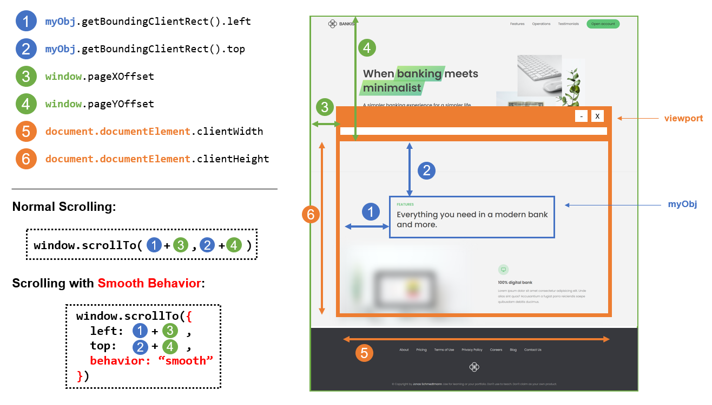
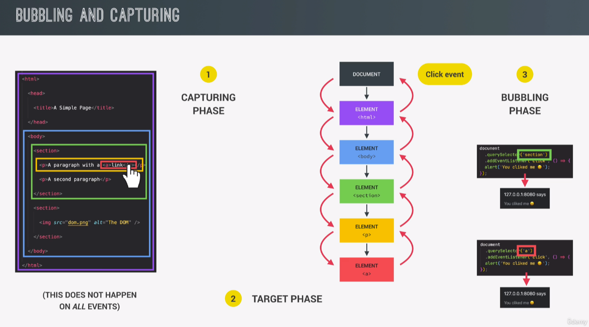
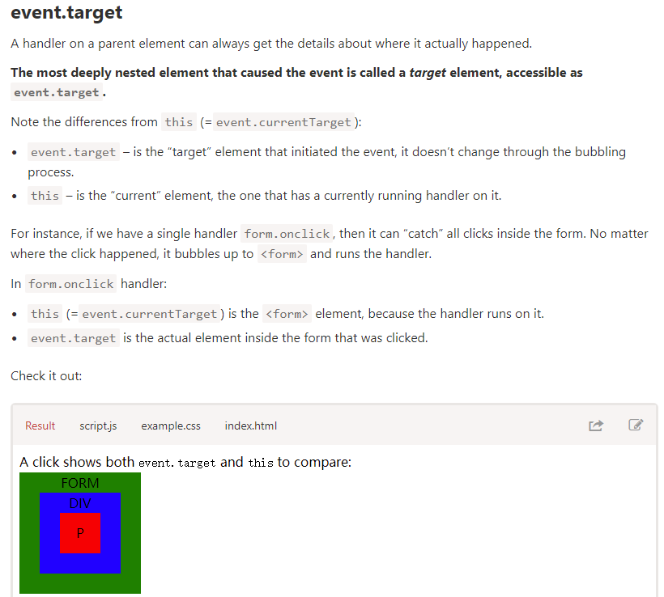
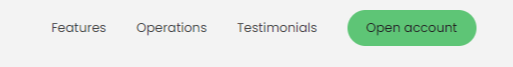

# Advanced DOM 2

## Style

- example

  ```javascript
  message.style.backgroundColor = "#37383d";
  message.style.width = "100%";
  const cookieInCSSColor = getComputedStyle(message).color;
  const cookieInCSSHeight = getComputedStyle(message).height;
  console.log(cookieInCSSColor); // 187 187 187
  console.log(cookieInCSSHeight); // 49px
  document.documentElement.style.setProperty("--color-primary", "cyan");
  message.style.height =
    Number.parseFloat(getComputedStyle(message).height, 10) + 20 + "px"; // 69px
  message.style.setProperty("color", "red");
  ```

## Attribute

- [When to use setAttribute vs .attribute= in JavaScript?](https://stackoverflow.com/questions/3919291/when-to-use-setattribute-vs-attribute-in-javascript)

  ```javascript
  myObj.setAttribute("className", "nameOfClass");
  myObj.setAttribute("id", "someID");
  myObj.className = "nameOfClass";
  myObj.id = "someID";
  ```

  > you only need to use setAttribute for non-standard attributes.

  ```javascript
  node.className = "test"; // works
  node.frameborder = "0"; // doesn't work - non standard attribute
  node.setAttribute("frameborder", "0"); // works
  ```

- [Attribute vs Property](https://stackoverflow.com/questions/6003819/what-is-the-difference-between-properties-and-attributes-in-html)

  > The job of attributes is to initialize the DOM object properties

  ```javascript
  const logo = document.querySelector(".nav__logo");
  const attri = logo.getAttribute("src");
  console.log(logo.alt);
  console.log(logo.src); // absolut url    http://127.0.0.1:5500/13-Advanced-DOM-Bankist/starter/img/logo.png
  console.log(attri); //img/logo.png
  logo.setAttribute("company_current", "Bankist");
  logo.setAttribute("alt", "Bankist");
  const version = logo.dataset.versionNumber;
  // version-number (in HTML)=> versionNumber (in js)
  // data-version-number="3.0" (In html)
  console.log(version); // 3.0
  ```

- Class
  ```javascript
  logo.classList.add("test");
  logo.classList.toggle("test");
  logo.classList.contains("test");
  logo.classList.remove("test");
  // Don't use
  logo.clasName = "Torin";
  // overide all remain only one class
  ```


## Smooth Scroll

- Old fashion way
  
  ```javascript
  const scrollLinkLearnMore = document.querySelector(".btn--scroll-to");
  const section1 = document.getElementById("section--1");
  scrollLinkLearnMore.addEventListener("click", function () {
    window.scrollTo({
      top: objRelativeY + curWindowY,
      behavior: "smooth",
    });
  });
  const objRelativeY = section1.getBoundingClientRect().top;
  const curWindowY = window.pageYOffset;
  ```
- Morden Way

  > Note: width&height of scroll bar all not into count. for 'document.documentElement.clientWidth'

  ```javascript
  scrollLinkLearnMore.addEventListener("click", function () {
    section1.scrollIntoView({ behavior: "smooth" });
  });
  ```

- CSS way
  ```css
  #section--1 {
    scroll-behavior: smooth;
  }
  ```

## Handel Eventlistener

- Example

  > normal way :

  ```javascript
  element.addEventListerer("mouseenter", fn);
  element.removeEventListeren("moseenter", fn);
  ```

  > property way

  ```javascript
  element.onclick = function () {};
  ```

  > attribute way (oldschool)

  ```html
  <element
    onclick="alert('some message')"
    mouseenter="console.log('somemessage')"
  >
  </element>
  ```

## Bubbling and Capturing



🎉🎉🎉🎉🎉[In detail tutorial](https://javascript.info/bubbling-and-capturing)🎉🎉🎉🎉🎉

```javascript
<style>
  body * {
    margin: 10px;
    border: 1px solid blue;
  }
</style>

<form>FORM
  <div>DIV
    <p>P</p>
  </div>
</form>

<script>
  for(let elem of document.querySelectorAll('*')) {
    elem.addEventListener("click", e => alert(`Capturing: ${elem.tagName}`), true);
    elem.addEventListener("click", e => alert(`Bubbling: ${elem.tagName}`));
  }
</script>
```

> event.target – is the “target” element that initiated the event, it doesn’t change through the bubbling process.

> this （=== e.current.target） – is the “current” element, the one that has a currently running handler on it.

> 

> Stopping bubbling

## Event Delegation (Navlink js-scroll with single handler)

- Low efficient way

  ```javascript
  document.querySelectorAll(".nav__link").forEach(function (el) {
    el.addEventListener("click", function (e) {
      e.preventDefault();
      document.querySelector(e.target.getAttribute("href")).scrollIntoView({
        behavior: "smooth",
      });
    });
  });
  ```

  

- High efficient way()
  ```javascript
  document.querySelector(".nav__links").addEventListener("click", function (e) {
    e.preventDefault();
    if (e.target.classList.contains("nav__link")) {
      document.querySelector(e.target.getAttribute("href")).scrollIntoView({
        behavior: "smooth",
      });
    }
  });
  ```


