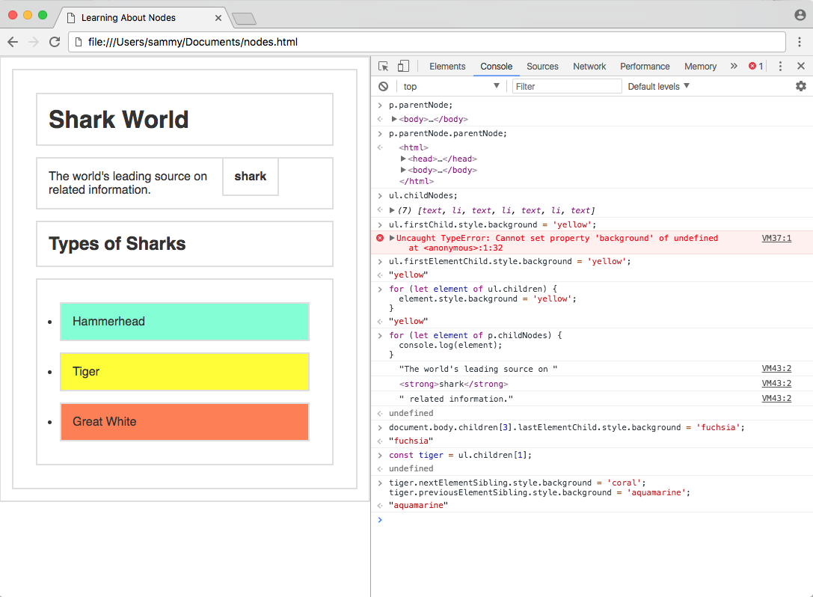
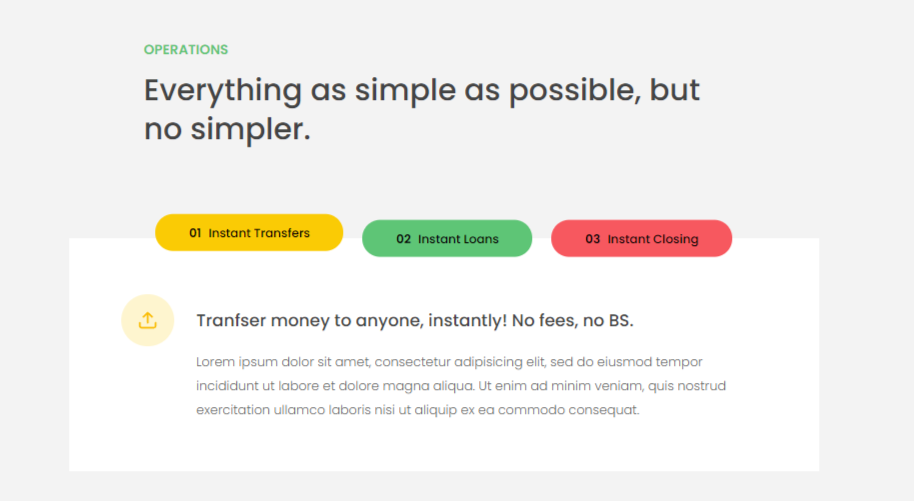

# Advanced DOM 3

## 1. DOM TRAVERSING

- Root Nodes

  > The document object is the root of every node in the DOM. This object is actually a property of the window object, which is the global, top-level object representing a tab in the browser. The window object has access to such information as the toolbar, height and width of the window, prompts, and alerts. The document consists of what is inside of the inner window.

  > Below is a chart consisting of the root elements that every document will contain. Even if a blank HTML file is loaded into a browser, these three nodes will be added and parsed into the DOM.

  | **Property**             | **Node**  | **Node Type** |
  | ------------------------ | --------- | ------------- |
  | document                 | #document | DOCUMENT_NODE |
  | document.documentElement | html      | ELEMENT_NODE  |
  | document.head            | head      | ELEMENT_NODE  |
  | document.body            | body      | ELEMENT_NODE  |

- Parent Nodes

  > The nodes in the DOM are referred to as parents, children, and siblings, There are two properties to get the parent — parentNode and parentElement.

  | **Property**  | **Gets**            |
  | ------------- | ------------------- |
  | parentNode    | Parent Node         |
  | parentElement | Parent Element Node |

  ```javascript
  // Assign html object to html variable
  const html = document.documentElement;

  console.log(html.parentNode); // > #document
  console.log(html.parentElement); // > null
  ```

- Children Nodes

  > The children of a node are the nodes that are one level below it. Any nodes beyond one level of nesting are usually referred to as descendants.

  | Property          | Gets                     |
  | ----------------- | ------------------------ |
  | childNodes        | Child Nodes              |
  | firstChild        | First Child Node         |
  | lastChild         | Last Child Node          |
  | children          | Element Child Nodes      |
  | firstElementChild | First Child Element Node |
  | lastElementChild  | Last Child Element Node  |

  - sniffis

    ```javascript
    ul.firstChild.style.background = "yellow";
    // Uncaught TypeError: Cannot set property 'background' of undefined
    ul.firstElementChild.style.background = "yellow";
    ```

    ```javascript
    for (let element of ul.children) {
      element.style.background = "yellow";
    }
    ```

    ```javascrip
    document.body.children[3].lastElementChild.style.background = 'fuchsia';
    ```

- Silbling Nodes

  > The siblings of a node are any node on the same tree level in the DOM. Siblings do not have to be the same type of node - text, element, and comment nodes can all be siblings.

  | Property               | Gets                          |
  | ---------------------- | ----------------------------- |
  | previousSibling        | Previous Sibling Node         |
  | nextSibling            | Next Sibling Node             |
  | previousElementSibling | Previous Sibling Element Node |
  | nextElementSibling     | Next Sibling Element Node     |

  - example

    ```javascript
    const tiger = ul.children[1];
    tiger.nextElementSibling.style.background = "coral";
    tiger.previousElementSibling.style.background = "aquamarine";
    ```

    

- Element.closest() (Write CSS Selector in Javscript)

  > do the opposite of ele.querySelector. witch select children.while closest() select ancensters

  > The closest() method traverses the Element and its parents (heading toward the document root) until it finds a node that matches the provided selector string. Will return itself or the matching ancestor. If no such element exists, it returns null.

  ```html
  <article>
    <div id="div-01">
      Here is div-01
      <div id="div-02">
        Here is div-02
        <div id="div-03">Here is div-03</div>
      </div>
    </div>
  </article>
  ```

  ```javascript
  var el = document.getElementById("div-03");

  var r1 = el.closest("#div-02");
  // returns the element with the id=div-02

  var r2 = el.closest("div div"); // self
  // returns the closest ancestor which is a div in div, here it  is the div-03 itself

  var r3 = el.closest("article > div");
  // returns the closest ancestor which is a div and has a parent   article, here it is the div-01

  var r4 = el.closest(":not(div)");
  // returns the closest ancestor which is not a div, here it is  the outmost article
  ```

## Tabbed Component

```javascript
const operaterChange = function (e) {
  // select button rather than span in it
  const targetButton = e.target.closest("button");
  // if (!targetButton) return;
  if (targetButton?.classList.contains("operations__tab")) {
    // control tab click effect
    [...targetButton.closest("div").children].forEach((ele) =>
      ele.classList.remove("operations__tab--active")
    );
    targetButton.classList.add("operations__tab--active");
    // const dateTab = targetButton.getAttribute('data-tab');
    // bad practice to use getAttr when we have ele.dataset.tab
    // control cards showing up
    section2
      .querySelectorAll(".operations__content")
      .forEach((ele) => ele.classList.remove("operations__content--active"));
    section2
      .querySelector(`.operations__content--${targetButton.dataset.tab}`)
      .classList.add("operations__content--active");
  }
};
section2.addEventListener("click", operaterChange);
```



## Menu Hover Effect (Pass argument(opacity) to event handler)

- Solution 1 : eventHandler.bind(opacity) / .bind([arr])

  ```javascript
  const handleHover = function (e) {
    console.log(this, e.currentTarget); // this = 0.5/1
    if (e.target.classList.contains("nav__link")) {
      const link = e.target;
      const siblings = link.closest(".nav").querySelectorAll(".nav__link");
      const logo = link.closest(".nav").querySelector("img");
      siblings.forEach((el) => {
        if (el !== link) el.style.opacity = this;
      });
      logo.style.opacity = this;
    }
  };
  nav.addEventListener("mouseover", handleHover.bind(0.5));
  nav.addEventListener("mouseout", handleHover.bind(1));
  console.log(handleHover.bind(1));
  ```

  

- Solution 2: Function Factory (clousure)

  ```javascript
  const handleHover = function (o) {
    return function (e) {
      if (e.target.classList.contains("nav__link")) {
        const link = e.target;
        const siblings = link.closest(".nav").querySelectorAll(".nav__link");
        const logo = link.closest(".nav").querySelector("img");

        siblings.forEach((el) => {
          if (el !== link) el.style.opacity = o;
        });
        logo.style.opacity = o;
      }
    };
  };
  // you can log the handleHover(0.1) to see that it returns a function which
  // has access to the argument(opacity value) passed to handleHover() due to
  // closures
  nav.addEventListener("mouseover", handleHover(0.5));
  nav.addEventListener("mouseout", handleHover(1));
  ```

  

  
