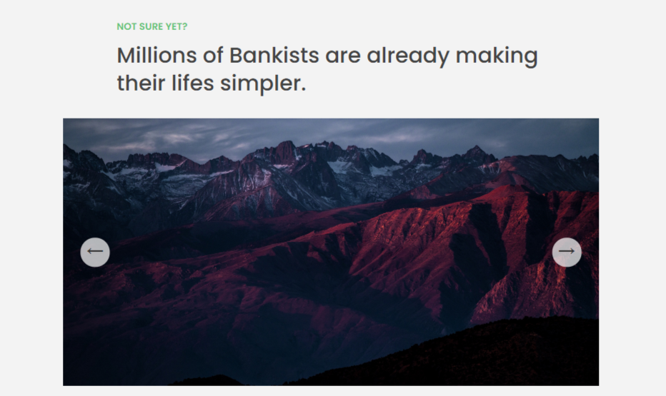

# SLIDER

## 1. Vanilla JavaScript🎉

- 1.1

  

  ```javascript
  // const slider = document.querySelector('.slider');
  // slider.style.transform = 'scale(0.4) translateX(-800px)';
  // slider.style.overflow = 'visible';
  const slides = document.querySelectorAll(".slide");
  const sliderBtnLeft = document.querySelector(".slider__btn--left");
  const sliderBtnRight = document.querySelector(".slider__btn--right");
  let curSlide = 0;

  const changeSlide = function (targetSlide) {
    slides.forEach(function (slide, i) {
      slide.style.transform = `translateX(${(i - targetSlide) * 100}%)`;
    });
  };
  changeSlide(0);

  const nextSlide = function () {
    if (curSlide === 0) {
      curSlide = slides.length - 1;
    } else {
      curSlide--;
    }
    changeSlide(curSlide);
  };
  const prevSlide = function () {
    if (curSlide === slides.length - 1) {
      curSlide = 0;
    } else {
      curSlide++;
    }
    changeSlide(curSlide);
  };
  sliderBtnLeft.addEventListener("click", nextSlide);
  sliderBtnRight.addEventListener("click", prevSlide);
  ```

- 1.2

  

  ```javascript
  const slides = document.querySelectorAll(".slide");
  const dotsContainer = document.querySelector(".dots");
  const sliderBtnLeft = document.querySelector(".slider__btn--left");
  const sliderBtnRight = document.querySelector(".slider__btn--right");
  let curSlide = 0;

  const creatDots = function () {
    slides.forEach(function (_, i) {
      dotsContainer.insertAdjacentHTML(
        "beforeend",
        `<button class="dots__dot" data-slide="${i}"></button>`
      );
    });
  };
  creatDots();
  const dots = document.querySelectorAll(".dots__dot");

  const changeSlide = function (targetSlide) {
    slides.forEach(function (slide, i) {
      slide.style.transform = `translateX(${(i - targetSlide) * 100}%)`;
    });
  };
  const activeDot = function (targetSlide) {
    // console.log(dots);
    dots.forEach((dot) => dot.classList.remove("dots**dot--active"));
    document
      .querySelector(`.dots**dot[data-slide="${targetSlide}"]`)
      .classList.add("dots__dot--active");
  };
  const init = function () {
    changeSlide(0);
    activeDot(0);
  };
  init();

  const prevSlide = function () {
    if (curSlide === 0) {
      curSlide = slides.length - 1;
    } else {
      curSlide--;
    }
    changeSlide(curSlide);
    activeDot(curSlide);
  };
  const nextSlide = function () {
    if (curSlide === slides.length - 1) {
      curSlide = 0;
    } else {
      curSlide++;
    }
    changeSlide(curSlide);
    activeDot(curSlide);
  };

  // Event handelers
  sliderBtnLeft.addEventListener("click", prevSlide);
  sliderBtnRight.addEventListener("click", nextSlide);
  document.addEventListener("keydown", function (e) {
    if (e.key === "ArrowLeft") prevSlide();
    e.key === "ArrowRight" && nextSlide(); // short circuiting sytax
  });
  dotsContainer.addEventListener("click", function (e) {
    if (!e.target?.classList.contains("dots__dot")) return;
    curSlide = +e.target.dataset.slide;
    changeSlide(curSlide); // 1
    activeDot(curSlide);
  });
  ```
