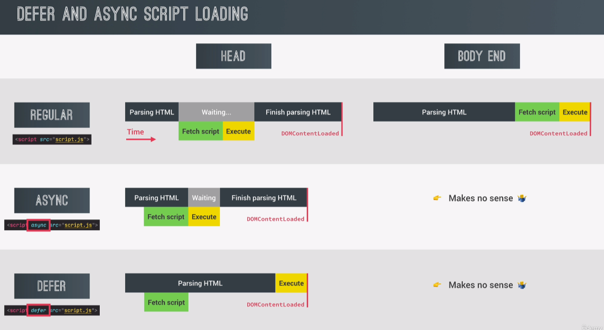
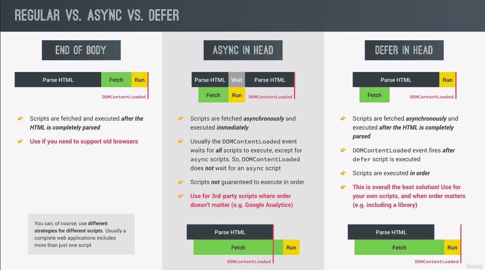

# LifeCycle DOM Events

## DOMContentLoaded

```javascript
document.addEventListener("DOMContentLoaded", function (e) {
  console.log("HTML parsed and DOM tree built!", e);
});
```

## load

```javascript
window.addEventListener('load',funciont(e){
  console.log('Page fully loaded', e);
})
```

## beforeunload

```javascript
window.addEventListener("beforeunload", function (e) {
  e.preventDefault();
  e.returnValue = "";
});
```




