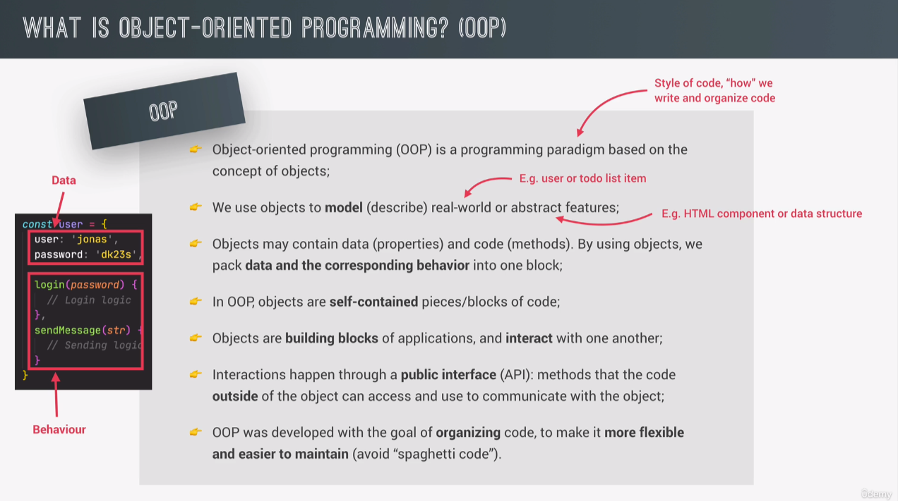
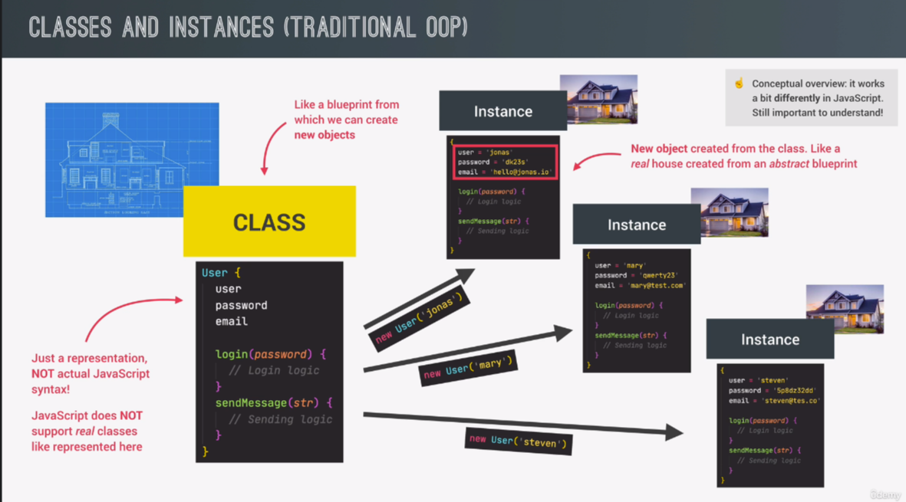
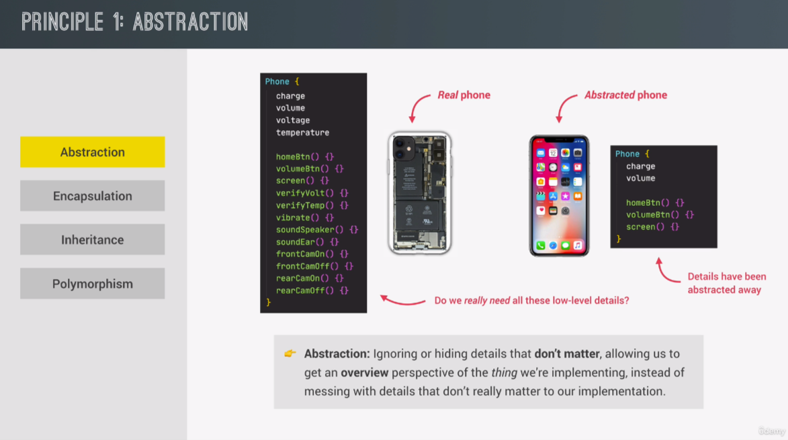
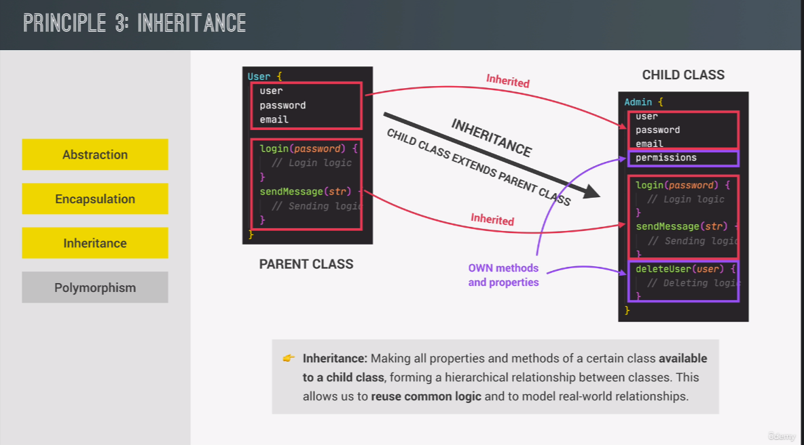
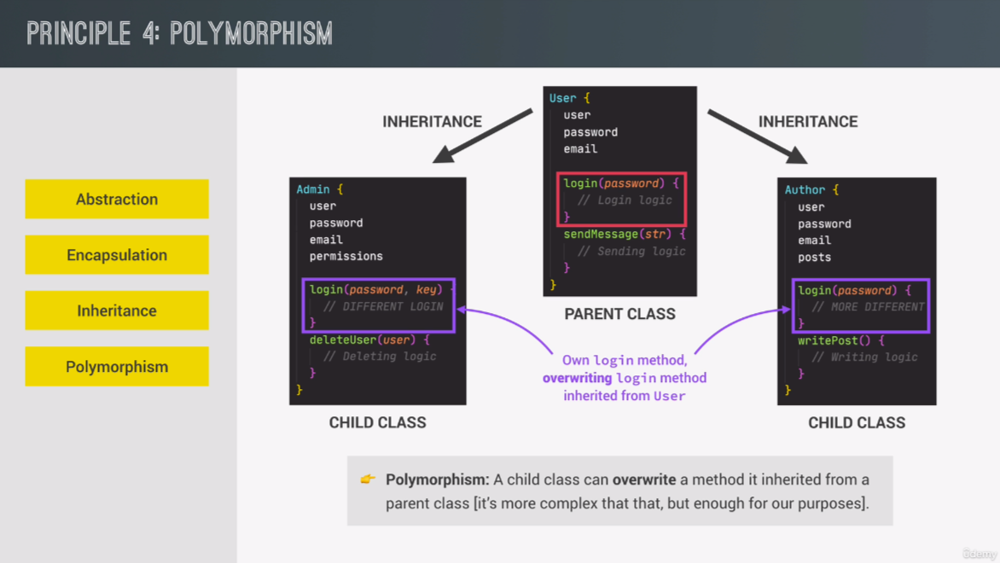
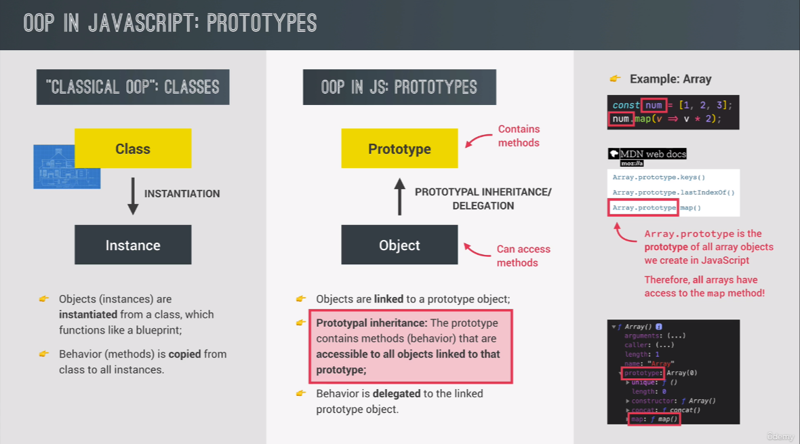
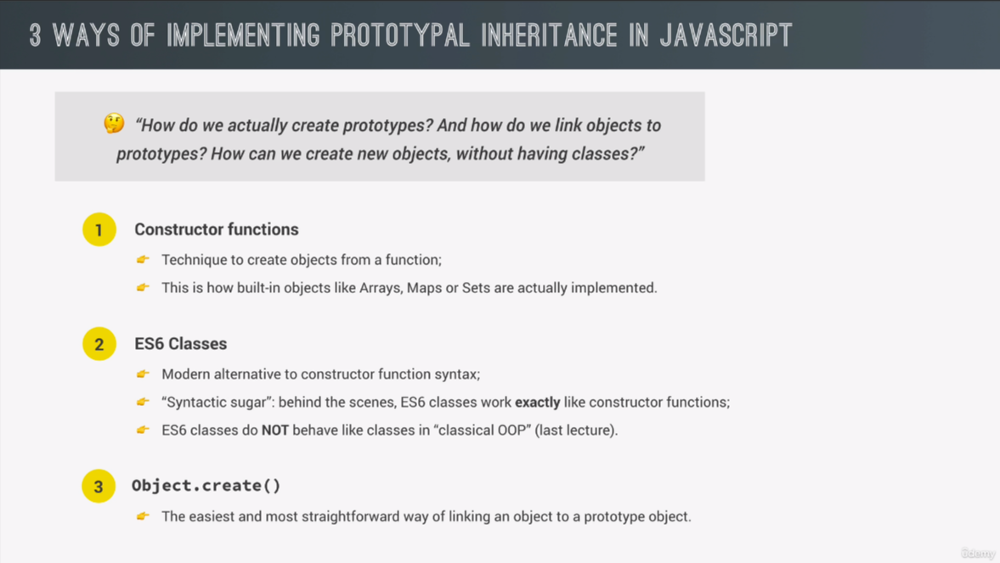
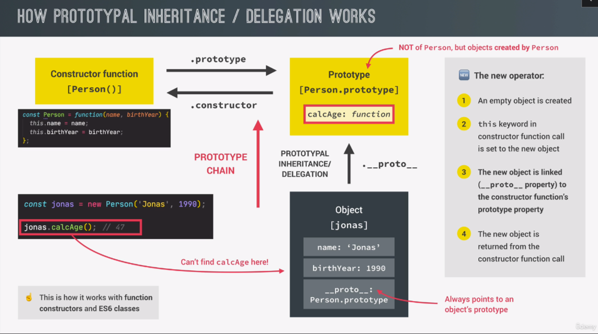
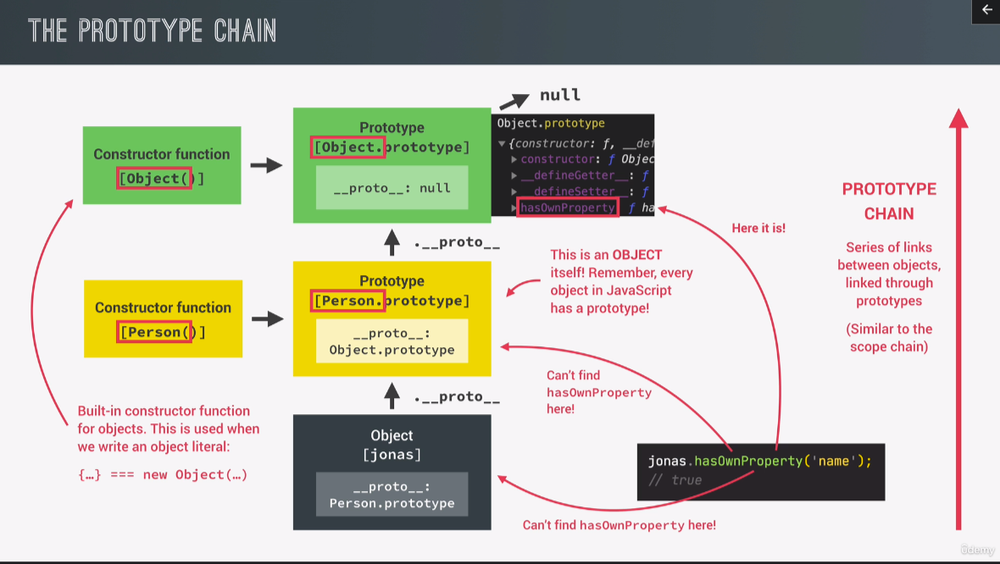

# OOP

## Concept of OOP





- Abstraction

  

- Encapsulation

  

- Inheritance

  

- Polymorphism

  

## OOP in JavaScript





## Constructor Functions & the new Operator

- Example

  ```javascript
  // Constructure Funtion construct Obj
  const Person = function (firstName, birthYear) {
    console.log(this); // Person {}
    // Instance properties
    this.firstName = firstName;
    this.birthYear = birthYear;
    // Never do this
    // this.calcAge = function () {
    //   console.log(2037 - this.birthYear);
    // };
    // We should use prototype inheritance
    // instead of creat method for each of the instance
  };
  // NO Arrow Function.
  // Arrow Funtions have no this keyword
  const torin = new Person("Torin", 1990);
  console.log(torin);
  // What new have done:
  // 1. a empty obj {} named Person is created
  // 2. function is called,  the this keyword point to {} in 1
  // 3. {} linked to prototype
  //     `torin.__proto__ === Person.prototype`
  // 4. function automatically return {}
  console.log(torin instanceof Person); //true
  ```

## Prototypes

> Each and every function in JavaScript automatically has a property called prototype. That includes constructor functions.

> Every OBJ that's created by a certain constructor function will get access to all te methods and properties we define on the constructors prototype property.

> E.g.: Person is a constructor. Person.prototype is its prototype property which is an OBJ. While instance Torin is a subOBJ, and Torin's prototype `torin.__proto__` is exactly === Person's prototype property.

> Person.prototype is not the prototype of Person, instead its will be the prototype of all OBJs created by Person.

> In this way, we only need to have a particular method in a single prototype OBJ, rather than have multiple same methods in every instance.

- Example

```javascript
const Person = function (firstName, birthYear) {
  console.log(this); // Person {}
  this.firstName = firstName;
  this.birthYear = birthYear;
};
Person.prototype.calcAge = function () {
  console.log(2037 - this.birthYear);
};
console.log(Person.prototype);
console.log(torin.__proto__);
// {calcAge: ƒ, constructor: ƒ}
console.log(torin.__proto__ === Person.prototype);
// true
torin.calcAge(); // will work
// test proto
// Why Person.prototype has this isPrototyprOf method???
// What is the prototype of Person.prototype
console.log(Person.prototype.isPrototypeOf(torin)); // ture
console.log(Person.prototype.isPrototypeOf(Person)); // false
```

- Add properties on the prototype

```javascript
Person.prototype.species = "Homo Sapiens";
torin.hasOwnProperty("firstName"); // true
torin.hasOwnProperty("species"); // false
```

## Prototype Inheritance & Prototype Chain

- 

  ```javascript
  console.log(torin.__proto__);
  // {calcAge: ƒ, constructor: ƒ}
  console.log(torin.__proto__.__proto__); // Object.prototype
  // {constructor: ƒ, __defineGetter__: ƒ, __defineSetter__: ƒ, hasOwnProperty: ƒ, __lookupGetter__: ƒ, …}
  console.log(torin.__proto__.__proto__.__proto__);
  // null
  ```

  ```javascript
  console.log(Person.prototype.constructor);
  ```

  > // Person itself ⬇⬇⬇⬇⬇⬇⬇⬇

  ```ƒ (firstName, birthYear) {
  console.log(this); // Person {}
  // Instance properties
  this.firstName = firstName;
  this.birthYear = birthYear;
  // Never do this
  // this.calcAge = function () {...}
  ```

  ```javascript
  console.dir(Person.prototype.constructor);
  ```

  > // Prson itself ⬇⬇⬇⬇⬇⬇⬇⬇

  ```
  ƒ Person(firstName, birthYear)
  length: 2
  name: "Person"
  prototype: {calcAge: ƒ, constructor: ƒ}
  arguments: (...)
  caller: (...)
  [[FunctionLocation]]: script.js:6
  [[Prototype]]: ƒ ()
  [[Scopes]]: Scopes[2]
  ```

- 

- E.G.: arr.**proto**

  ```javascript
  const arr = [1, 2, 3, 4, 5];
  console.log(arr.__proto__); // [constructor: ƒ, concat: ƒ, copyWithin: ƒ, fill: ƒ, find: ƒ, …]
  arr.__proto__ === Array.prototype; // true
  const a = arr.__proto__.__proto__;
  const b = Object.prototype;
  a === b; //true
  console.log(arr.__proto__.__proto__ === torin.__proto__.__proto__); // {constructor: ƒ, __defineGetter__: ƒ, __defineSetter__: ƒ, hasOwnProperty: ƒ, __lookupGetter__: ƒ, …}
  ```

  > E.G. Array.prototype.fill()  
  > Array is an OBJ which has a property called prototype
  > And that prototype is an OBJ as well which
  > has a method called fill()

  ```javascript
  // Lets add method to prototype
  // Not recommended
  const arr = [1, 2, 2, 2, 2];
  Array.prototype.unique = function () {
    return [...new Set(this)];
  };
  console.log(arr.unique()); // [1,2]
  ```

- E.G.: DomElement.**proto**

  ```javascript
  // Insane DOM proto chain
  // h1 => Null
  h1; // OBJ
  h1.__proto__; // HTMLHeadingElement
  h1.__proto__.__proto__; // HTMLElement
  h1.__proto__.__proto__.__proto__; // Element
  h1.__proto__.__proto__.__proto__.__proto__; // Node
  h1.__proto__.__proto__.__proto__.__proto__.__proto__; // EventTarget
  h1.__proto__.__proto__.__proto__.__proto__.__proto__.__proto__; // Object
  h1.__proto__.__proto__.__proto__.__proto__.__proto__.__proto__.__proto__; // Null
  ```

- E.G.: function.**proto**

  ```javascript
  // Insane function proto chain
  const test = function (x) {
    return x + 1;
  };
  console.dir(test.__proto__); // ƒ anonymous()
  console.dir(test.__proto__.__proto__); // Object

  console.dir((x) => x + 1); // anonymous()
  console.dir(((x) => x + 1).__proto__); // ƒ anonymous()
  console.dir(((x) => x + 1).__proto__.__proto__); // OBJ
  ```


## Challenge #1

> Your tasks:<br>
>
> 1. Use a constructor function to implement a 'Car'. A car has a 'make' and a 'speed' property. The 'speed' property is the current speed of the car in km/h <br>
> 2. Implement an 'accelerate' method that will increase the car's speed by 10, and log the new speed to the console <br>
> 3. Implement a 'brake' method that will decrease the car's speed by 5, and log the new speed to the console <br>
> 4. Create 2 'Car' objects and experiment with calling 'accelerate' and 'brake' multiple times on each of them<br>
>    Test data: <br>
>    Data car 1: 'BMW' going at 120 km/h <br>
>    Data car 2: 'Mercedes' going at 95 km/h

```javascript
const Car = function (make, speed) {
  this.make = make;
  this.speed = speed;
};
Car.prototype.accelerate = function () {
  this.speed += 10;
  console.log(`${this.make} going at ${this.speed} km/h.`);
};
const bmw = new Car("BMW", 120);
console.dir(car1);
bmw.accelerate();
bmw.accelerate();
bmw.accelerate();
```

> that bmw contain all its data, <br>
> and methods to manipulate its own data as well<br>
> that methods are some kind of public interface<br>
> OOP 👏
