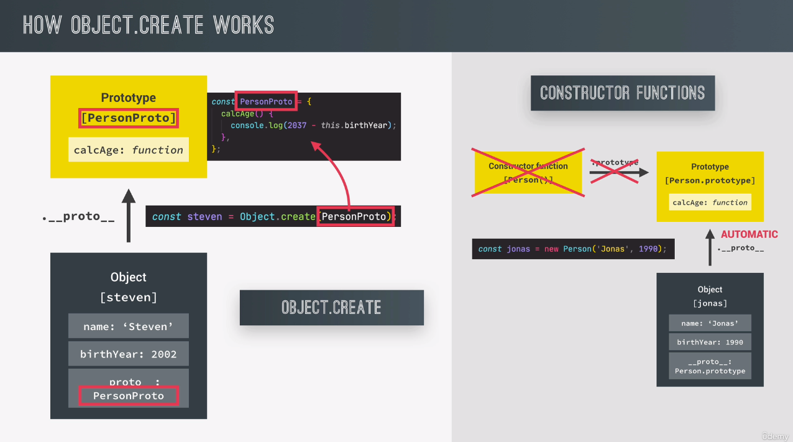

# OOP2

## ES6 Classes

## [Setters & Getters](https://javascript.info/property-accessors)

> They are functions to manipulate data, But from outside<br>
> they look like properties.

```javascript
const account = {
  owner: "torin",
  movements: [200, 300, 400],
  get latest() {
    return this.movements.slice(-1).pop();
  },
  set latest(mov) {
    this.movements.push(mov);
  },
};
console.log(account.latest); //400
account.latest = 999; // [200, 300, 400 999]
// its OK to have the same name
```

```javascript
class PersonCl {
  constructor(firstName, birthYear) {
    this.firstName = firstName;
    this.birthYear = birthYear;
  }
  calcAge() {
    console.log(2037 - this.birthYear);
  }
  get age() {
    return 2037 - this.birthYear;
  }
}
const torin1 = new PersonCl("Torin", 1990);
console.log(torin1);
```

> What if I wanna set a already exist property ?

> Use setter to implement validation.

```javascript
class Account {
  constructor(password) {
    if (password.length > 8) {
      this.password = password;
    }
  }
}
const account1 = new Account("123456789");
console.log(account1);
account1.password = "123";
console.log(account1);
```

> now That's bad. My lenght check only happens at construting phase.

```javascript
class AccountFix {
  constructor(password) {
    this.password = password;
  }
  set password(pass) {
    if (pass.length > 6) this._password = pass;
    else console.log("too short");
  }
  get password() {
    return this._password;
  }
  // faked this.password property.
}

const account2 = new AccountFix("123456789");
console.log(account2.password); // 123456789
account2.password = "123";
console.log(account2.password); // 123456789
const account3 = new AccountFix("123");
console.log(account3); // OBJ with no property
```

```javascript
let user = {
  get name() {
    return this._name;
  },

  set name(value) {
    if (value.length < 4) {
      alert("Name is too short, need at least 4 characters");
      return;
    }
    this._name = value;
  },
};

user.name = "Pete";
alert(user.name); // Pete

user.name = ""; // Name is too short...
```

> Getters/setters can be used as wrappers over “real” property values to gain more control over operations with them.<br>

> For instance, if we want to forbid too short names for user, we can have a setter name and keep the value in a separate property `_name`:<br>

## Stactic Methods

> 'Array.from()'

> We cannot call `Array.from()` on common arrays,<br> because its attached onto the Array() constructor itself. rather than Array.prototype.<br> In this case its not inheritenced. so array cannot call it.

> We also say the from() method is in the Array name space

> `Number.parseFloat()` as well

- Implement Static Method in ES6 Class

  ```javascript
  class Whatever {
    constructor(a) {
      this.a = a;
    }
    instanceMethods() {
      return this.a;
    }
    static staticMethod() {
      return "You cannot call this on instance";
    }
  }

  Whatever.staticMethod(); // "You cannot call this on instance"
  ```

## Object.create



> No constructor prototype properties involved

> No constructor function

> Use Object.create to manually set the prototype of an object

> let's create a OBJ , and set it to be the Person's prototype

```javascript
const PersonProto = {
  calcAge() {
    console.log(2037 - this.birthYear);
  },
  init(firstName, birthYear) {
    this.firstName = firstName;
    this.birthYear = birthYear;
  },
  // this has nothon to do with constructor fn
};
const steven = Object.create(PersonProto);
steven.init("Steven", 1999);
steven.calcAge();
steven.__proto__ === PersonProto; //true
```

## Coding Challenge #2

```
Your tasks:
1. Re-create Challenge #1, but this time using an ES6 class (call it 'CarCl')
2. Add a getter called 'speedUS' which returns the current speed in mi/h (divide by 1.6)
3. Add a setter called 'speedUS' which sets the current speed in mi/h (but converts it to km/h before storing the value, by multiplying the input by 1.6)
4. Create a new car and experiment with the 'accelerate' and 'brake' methods, and with the getter and setter.
Test data:
§ Data car 1: 'Ford' going at 120 km/h
```

```javascript
class CarCl {
  constructor(brand, speed) {
    this.brand = brand;
    this.speed = speed;
  }
  get speedUS() {
    return this.speed / 1.6;
  }
  set speedUS(speedInput) {
    this.speed = speedInput * 1.6;
  }
  accelerate() {
    this.speed += 10;
    console.log(`${this.brand} going at ${this.speed} km/h.`);
  }
}
const ford = new CarCl("Ford", 240);
console.log(ford.speedUS); //150
ford.speedUS = 60;
console.log(ford.speedUS); // 60
ford.accelerate(); // Ford going at 106 km/h.
```
