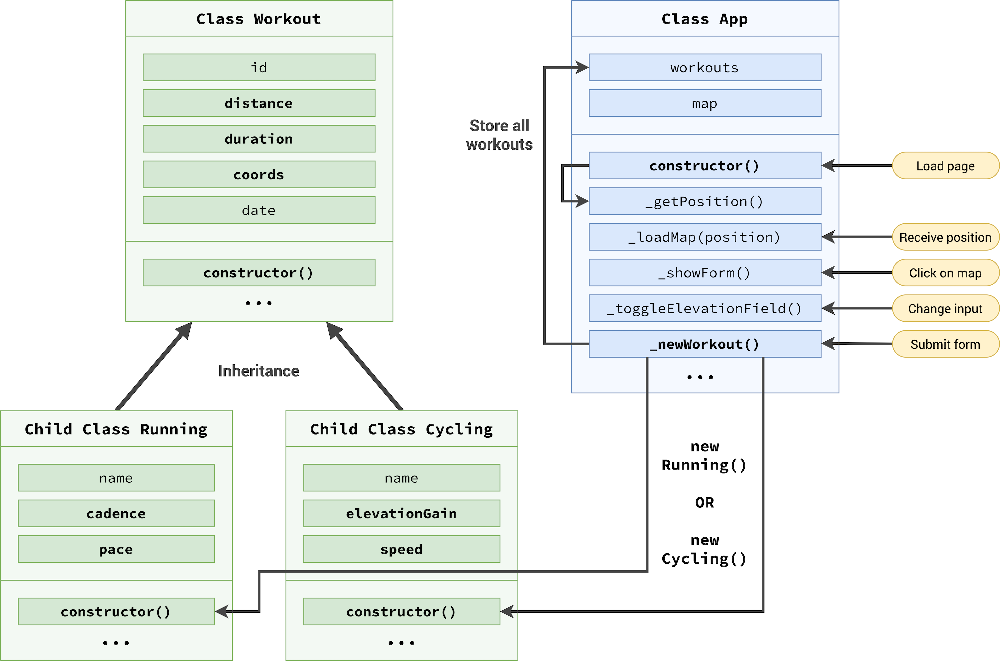
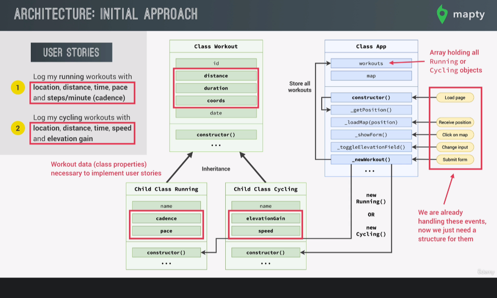

# MaptyApp 1:

## [Geolocation](https://developer.mozilla.org/en-US/docs/Web/API/Geolocation_API)

- [Using the Geolocation API](https://developer.mozilla.org/en-US/docs/Web/API/Geolocation_API/Using_the_Geolocation_API)

- [Cached Positions in the Geolocation API](https://softwareas.com/cached-positions-in-the-geolocation-api/)

- Example

  ```javascript
  navigatior.geolocation.getCurrentPosition(fn(success), fn(fail), option);
  ```

  ```javascript
  if (navigator.geolocation)
    navigator.geolocation.getCurrentPosition(
      function (position) {
        console.log(position);
        const { latitude, longitude } = position.coords;
        console.log(
          `https://www.google.com/maps/@${latitude},${longitude},10z`
        );
      },
      function () {
        alert("No Promission");
      },
      { maximumAge: 60_000, timeout: 0, enableHighAccuracy: true }
    );
  ```

## [Leaflet Library](https://leafletjs.com/)

- MaptyApp Example

  ```html
  <link
    rel="stylesheet"
    href="https://unpkg.com/leaflet@1.7.1/dist/leaflet.css"
    integrity="sha512-xodZBNTC5n17Xt2atTPuE1HxjVMSvLVW9ocqUKLsCC5CXdbqCmblAshOMAS6/keqq/sMZMZ19scR4PsZChSR7A=="
    crossorigin=""
  />
  <script
    defer
    src="https://unpkg.com/leaflet@1.7.1/dist/leaflet.js"
    integrity="sha512-XQoYMqMTK8LvdxXYG3nZ448hOEQiglfqkJs1NOQV44cWnUrBc8PkAOcXy20w0vlaXaVUearIOBhiXZ5V3ynxwA=="
    crossorigin=""
  ></script>
  <script defer src="script.js"></script>
  ```

  > The order of 2 script and the defer attribute is major!

- Architecture

  - DATA STORE

    

    

  - Code 1

    ```javascript
    class App {
      #map;
      #mapEvent;
      constructor() {
        this.#getPosition();
        form.addEventListener("submit", this.#newWorkot.bind(this));
        inputType.addEventListener("change", this.#toggleElevationField);
      }
      #getPosition() {
        console.log(this);
        if (navigator.geolocation)
          navigator.geolocation.getCurrentPosition(
            this.#loadMap.bind(this),
            function () {
              alert("No Promission");
            }
            // { maximumAge: 60_000, timeout: 0, enableHighAccuracy: true }
          );
      }
      #loadMap(position) {
        console.log(position);
        const { latitude, longitude } = position.coords;
        const coords = [latitude, longitude];
        console.log(this);
        this.#map = L.map("map").setView(coords, 13);
        L.tileLayer("https://{s}.tile.openstreetmap.fr/hot/{z}/{x}/{y}.png", {
          attribution:
            '&copy; <a href="https://www.openstreetmap.org/copyright">OpenStreetMap</a> contributors',
        }).addTo(this.#map);
        this.#map.on("click", this.#showForm.bind(this));
      }
      #showForm(mapE) {
        this.#mapEvent = mapE;
        form.classList.remove("hidden");
        inputDistance.focus();
      }
      #toggleElevationField() {
        inputElevation
          .closest(".form__row")
          .classList.toggle("form__row--hidden");
        inputCadence
          .closest(".form__row")
          .classList.toggle("form__row--hidden");
      }
      #newWorkot(e) {
        e.preventDefault();
        const { lat, lng } = this.#mapEvent.latlng;
        const marker = L.marker([lat, lng], {
          opacity: 0.99,
          riseOnHover: true,
          draggable: true,
        });
        marker
          .addTo(this.#map)
          .bindPopup(
            L.popup({
              maxWidth: 250,
              minWidth: 100,
              autoClose: false,
              closeOnClick: false,
              className: "running-popup",
            })
          )
          .setPopupContent("WorkOut")
          .openPopup();
        this.#clearText();
        this.#hideForm();
      }
      #clearText = function () {
        inputDistance.value = "";
        inputCadence.value = "";
        inputDuration.value = "";
        inputElevation.value = "";
      };
      #hideForm = function () {
        form.classList.add("hidden");
      };
    }
    const app = new App();
    ```

  - Code 2

    ```javascript
    class WorkOut {
      data = new Date();
      id = (Date.now() + "").slice(-10);
      constructor(coords, distance, duration) {
        this.coords = coords; // [lat,lng]
        this.distance = distance; // in km
        this.duration = duration; // in min
      }
    }
    class Running extends WorkOut {
      constructor(coords, distance, duration, cadence) {
        super(coords, distance, duration);
        this.cadence = cadence;
        this.clacPace();
      }
      clacPace() {
        // min/km
        this.pace = this.duration / this.distance;
      }
    }
    class Cycling extends WorkOut {
      constructor(coords, distance, duration, elevationGain) {
        super(coords, distance, duration);
        this.elevationGain = elevationGain;
        this.clacSpeed();
      }
      clacSpeed() {
        // km/h
        this.speed = this.distance / (this.duration / 60);
      }
    }
    ```

  - Final FlowChart

    

  - Code 3

    ```javascript
    class WorkOut {
      date = new Date();
      id = (Date.now() + "").slice(-10);
      clicks = 0;
      constructor(coords, distance, duration) {
        this.coords = coords; // [lat,lng]
        this.distance = distance; // in km
        this.duration = duration; // in min
      }
      _setDescription() {
        // prettier-ignore
        const months = ['January', 'February', 'March', 'April', 'May', 'June', 'July', 'August', 'September', 'October', 'November', 'December'];
        console.log(this);
        this.description = `${this.type[0].toUpperCase()}${this.type.slice(
          1
        )} on ${months[this.date.getMonth()]} ${this.date.getDate()}`;
      }
      click() {
        this.clicks++;
      }
    }
    class Running extends WorkOut {
      type = "running";
      constructor(coords, distance, duration, cadence) {
        super(coords, distance, duration);
        this.cadence = cadence;
        this.clacPace();
        this._setDescription();
      }
      clacPace() {
        // min/km
        this.pace = this.duration / this.distance;
      }
    }
    class Cycling extends WorkOut {
      type = "cycling";
      constructor(coords, distance, duration, elevationGain) {
        super(coords, distance, duration);
        this.elevationGain = elevationGain;
        this.clacSpeed();
        this._setDescription();
      }
      clacSpeed() {
        // km/h
        this.speed = this.distance / (this.duration / 60);
      }
    }
    class App {
      #map; // return by Liberay
      #mapEvent; // info get by map clicking
      #workouts = [];
      #mapZoomLevel = 13;
      constructor() {
        console.log(this);
        this.#getPosition();
        form.addEventListener("submit", this.#newWorkot.bind(this));
        inputType.addEventListener("change", this.#toggleElevationField);
        containerWorkouts.addEventListener(
          "click",
          this.#moveToPopup.bind(this)
        );
        this.#getLocalStorage();
      }
      #getPosition() {
        if (navigator.geolocation)
          navigator.geolocation.getCurrentPosition(
            this.#loadMap.bind(this),
            function () {
              alert("No Promission");
            }
            // { maximumAge: 60_000, timeout: 0, enableHighAccuracy: true }
          );
      }
      #loadMap(position) {
        const { latitude, longitude } = position.coords;
        const coords = [latitude, longitude];
        this.#map = L.map("map").setView(coords, this.#mapZoomLevel);
        L.tileLayer("https://{s}.tile.openstreetmap.fr/hot/{z}/{x}/{y}.png", {
          attribution:
            '&copy; <a href="https://www.openstreetmap.org/copyright">OpenStreetMap</a> contributors',
        }).addTo(this.#map);
        this.#map.on("click", this.#showForm.bind(this));
        this.#workouts.forEach((work) => {
          this.#renderWorkoutMarker(work);
        });
      }
      #showForm(mapE) {
        this.#mapEvent = mapE;
        form.classList.remove("hidden");
        inputDistance.focus();
      }
      #toggleElevationField() {
        inputElevation
          .closest(".form__row")
          .classList.toggle("form__row--hidden");
        inputCadence
          .closest(".form__row")
          .classList.toggle("form__row--hidden");
      }
      #newWorkot(e) {
        console.log(e); // submit event
        console.log(this); // App instance
        e.preventDefault();
        const validInputs = (...inputs) =>
          inputs.every((inp) => Number.isFinite(inp));
        const allPositive = (...inputs) => inputs.every((inp) => inp > 0);
        const type = inputType.value;
        const distance = +inputDistance.value;
        const duration = +inputDuration.value;
        const { lat, lng } = this.#mapEvent.latlng;
        let workout;
        if (type === "running") {
          const cadence = +inputCadence.value;
          if (
            !validInputs(distance, duration, cadence) ||
            !allPositive(distance, duration, cadence)
          )
            return alert("Inputs have to be posstive numbers");
          workout = new Running([lat, lng], distance, duration, cadence);
          this.#workouts.push(workout);
        }
        if (type === "cycling") {
          const elevation = +inputElevation.value;
          if (
            !validInputs(distance, duration, elevation) ||
            !allPositive(distance, duration)
          )
            return alert("Inputs have to be posstive numbers");
          workout = new Cycling([lat, lng], distance, duration, elevation);
          this.#workouts.push(workout);
        }
        this.#renderWorkoutMarker(workout);
        this.#renderWorkout(workout);
        this.#clearText();
        this.#hideForm();
        this.#setLocalStorage();
      }
      #clearText() {
        inputDistance.value = "";
        inputCadence.value = "";
        inputDuration.value = "";
        inputElevation.value = "";
      }
      #hideForm() {
        form.style.display = "none";
        form.classList.add("hidden");
        setTimeout(() => (form.style.display = "grid"), 1000);
      }
      #renderWorkout(workout) {
        let html = `
        <li class="workout workout--${workout.type}" data-id="${workout.id}">
              <h2 class="workout__title">${workout.description}</h2>
              <div class="workout__details">
                <span class="workout__icon">${
                  workout.type === "running" ? "🏃‍♂️" : "🚴‍♀️"
                }</span>
                <span class="workout__value">${workout.distance}</span>
                <span class="workout__unit">km</span>
              </div>
              <div class="workout__details">
                <span class="workout__icon">⏱</span>
                <span class="workout__value">${workout.duration}</span>
                <span class="workout__unit">min</span>
              </div>
              `;
        if (workout.type === "running") {
          html += `
              <div class="workout__details">
                <span class="workout__icon">⚡️</span>
                <span class="workout__value">${workout.pace.toFixed(1)}</span>
                <span class="workout__unit">min/km</span>
              </div>
              <div class="workout__details">
                <span class="workout__icon">${workout.cadence}</span>
                <span class="workout__value">178</span>
                <span class="workout__unit">spm</span>
              </div>
            </li>`;
        }
        if (workout.type === "cycling") {
          html += `
              <div class="workout__details">
                <span class="workout__icon">⚡️</span>
                <span class="workout__value">${workout.speed.toFixed(1)}</span>
                <span class="workout__unit">km/h</span>
              </div>
              <div class="workout__details">
                <span class="workout__icon">⛰</span>
                <span class="workout__value">${workout.elevationGain}</span>
                <span class="workout__unit">m</span>
              </div>
            </li>`;
        }
        form.insertAdjacentHTML("afterend", html);
      }
      #renderWorkoutMarker(workout) {
        L.marker(workout.coords, {
          opacity: 0.99,
          riseOnHover: true,
          draggable: true,
        })
          .addTo(this.#map)
          .bindPopup(
            L.popup({
              maxWidth: 250,
              minWidth: 100,
              autoClose: false,
              closeOnClick: false,
              className: `${workout.type}-popup`,
            })
          )
          .setPopupContent(
            `${workout.type === "running" ? "🏃‍♂️" : "🚴‍♀️"} ${workout.description}`
          )
          .openPopup();
      }
      #moveToPopup(e) {
        const workoutEl = e.target.closest(".workout");
        console.log(workoutEl);
        if (!workoutEl) return;
        const workout = this.#workouts.find(
          (work) => work.id === workoutEl.dataset.id
        );
        this.#map.setView(workout.coords, this.#mapZoomLevel, {
          animate: true,
          pan: {
            duration: 1,
          },
        });
        // using the public interface
        // workout.click();
        // console.log(workout.clicks);
      }
      #setLocalStorage() {
        localStorage.setItem("workouts", JSON.stringify(this.#workouts));
      }
      #getLocalStorage() {
        const data = JSON.parse(localStorage.getItem("workouts"));
        console.log(data);
        if (!data) return;
        this.#workouts = data;
        this.#workouts.forEach((work) => {
          this.#renderWorkout(work);
          // this.#renderWorkoutMarker(work);  can't do this now (no map yet)
        });
      }
      reset() {
        localStorage.removeItem("workouts");
        location.reload();
      }
    }
    const app = new App();
    ```
