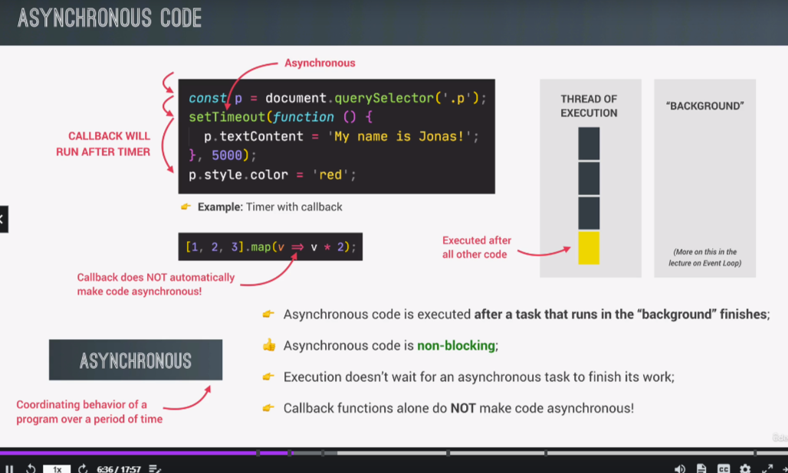
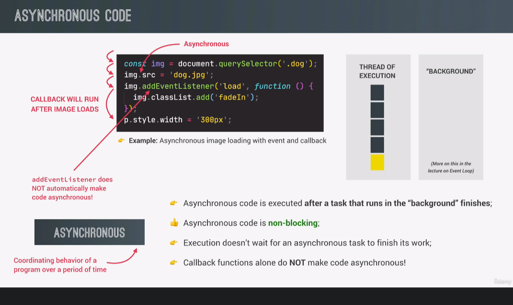
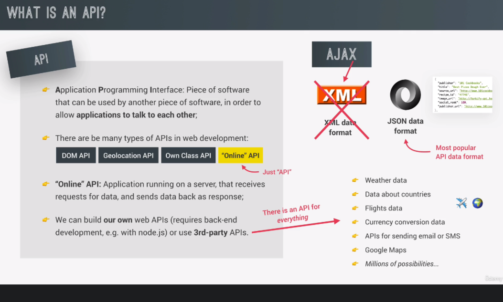
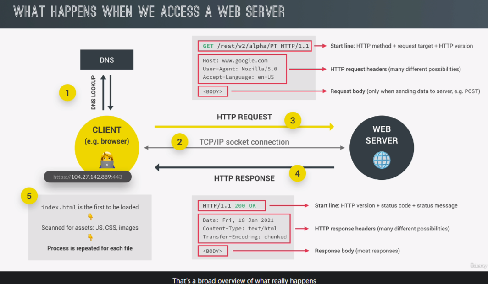
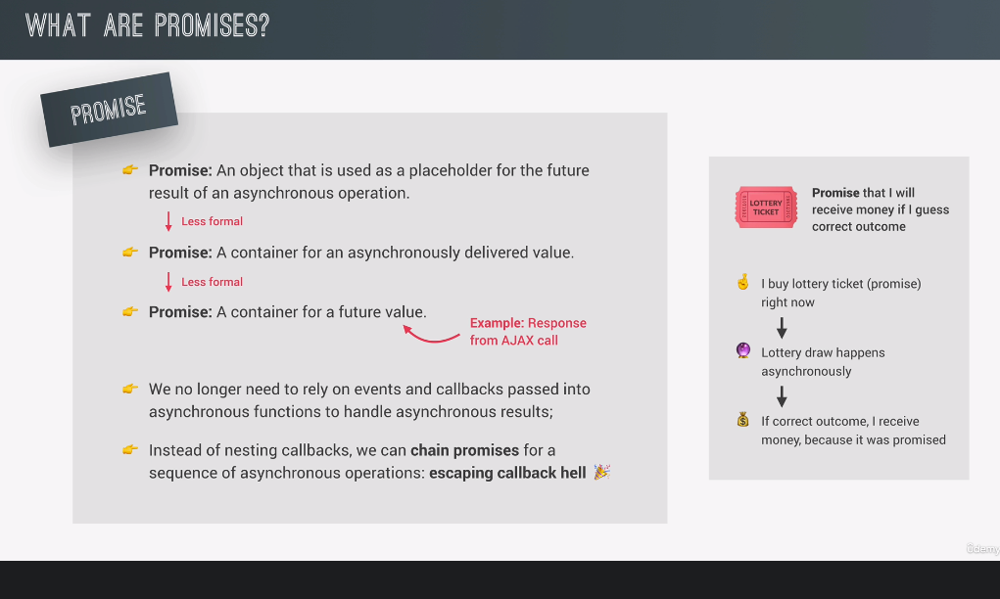
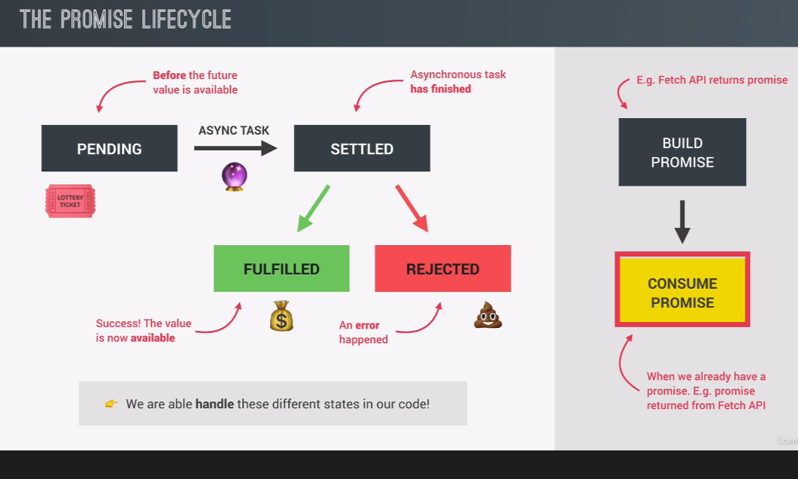

# Asynchronous

## Synchronous Example


## Asynchronous Type





## AJAX

> AJAX: Asynchronous JavaScript And XML.

- Slides

  

  

- Example

  ```javascript
  const getCountryData = function (country) {
    const request = new XMLHttpRequest();
    request.open("GET", `https://restcountries.com/v2/name/${country}`);
    request.send();
    request.addEventListener("load", function () {
      const [data] = JSON.parse(this.responseText);
      console.log(data);
      const html = `<article class="country">
            
            <div class="country__data">
              <h3 class="country__name">${data.name}</h3>
              <h4 class="country__region">${data.region}</h4>
              <p class="country__row"><span>👫</span>${(
                +data.population / 100000000
              ).toFixed(1)} 亿人</p>
              <p class="country__row"><span>🗣️</span>${
                data.languages[0].name
              }</p>
              <p class="country__row"><span>💰</span>${
                data.currencies[0].name
              }</p>
            </div>
          </article>`;
      countriesContainer.insertAdjacentHTML("beforeend", html);
      countriesContainer.style.opacity = 1;
    });
  };
  getCountryData("cn");
  getCountryData("Canada");
  getCountryData("portugal");
  getCountryData("Japan");
  ```

  

- Example : Callback HEll

  > Callback hell: nested async to order a sequence, e.g. call timer inside another timer.

  ```javascript
  const renderCountry = function (data, className = "") {
    const html = `<article class="country ${className}">
            
            <div class="country__data">
              <h3 class="country__name">${data.name}</h3>
              <h4 class="country__region">${data.region}</h4>
              <p class="country__row"><span>👫</span>${(
                +data.population / 100000000
              ).toFixed(1)} 亿人</p>
              <p class="country__row"><span>🗣️</span>${
                data.languages[0].name
              }</p>
              <p class="country__row"><span>💰</span>${
                data.currencies[0].name
              }</p>
            </div>
          </article>`;
    countriesContainer.insertAdjacentHTML("beforeend", html);
    countriesContainer.style.opacity = 1;
  };

  const getCountryAndNeighbour = function (country) {
    // AJAX call country 1
    const request = new XMLHttpRequest();
    request.open("GET", `https://restcountries.com/v2/name/${country}`);
    request.send();
    request.addEventListener("load", function () {
      const [data] = JSON.parse(this.responseText);
      //render contry 1
      renderCountry(data);

      // Get neighbour country 2
      const [neighbour] = data.borders;
      if (!neighbour) return;

      // AJAX call 2
      const request2 = new XMLHttpRequest();
      request2.open("GET", `https://restcountries.com/v2/alpha/${neighbour}`);
      request2.send();
      request2.addEventListener("load", function () {
        const data2 = JSON.parse(this.responseText);
        renderCountry(data2, "neighbour");
      });
    });
  };
  getCountryAndNeighbour("germany");
  ```

- Promise: excape callback hell

  > Promise: An object that is used as a placeholder for the future result of an asynchronous operation. (A container for a future value).

  

  ```javascript
  // const request = new XMLHttpRequest();
  // request.open('GET', `https://restcountries.com/v2/name/${country}`);
  const request = fetch("https://restcountries.com/v2/name/${country}");
  console.log(request);
  // It's a promise obj
  ```

  

  > Once settled the state of cannot be changed (e.g. rejected -> fulfilled)

  ```javascript
  // const getCountryData = function (country) {
  //   fetch(`https://restcountries.com/v2/name/${country}`)
  //     .then(function (response) {
  //       return response.json();
  //       // .json() also return a promise
  //     })
  //     .then(function (data) {
  //       console.log(data);
  //       renderCountry(data[0]);
  //     });
  // };
  const getCountryData = function (country) {
    fetch(`https://restcountries.com/v2/name/${country}`)
      .then((response) => response.json())
      .then((data) => renderCountry(data[0]));
  };
  getCountryData("USA");
  ```

  > Promise Chain(render nagubour)

  ```javascript
  const getCountryData = function (country) {
    fetch(`https://restcountries.com/v2/name/${country}`)
      .then((response) => response.json())
      .then((data) => {
        const neighbour = data[0].borders[0];
        renderCountry(data[0]);
        return fetch(`https://restcountries.com/v2/alpha/${neighbour}`);
      })
      .then((response) => response.json())
      .then((data) => renderCountry(data, "neighbour"));
  };
  getCountryData("cn");
  ```

  > always return a promise and handle it outside by continue the chain.

- Handel Errors

  ```javascript
  const renderCountry = function (data, className = "") {
    const html = `<article class="country ${className}">
            
            <div class="country__data">
              <h3 class="country__name">${data.name}</h3>
              <h4 class="country__region">${data.region}</h4>
              <p class="country__row"><span>👫</span>${(
                +data.population / 100000000
              ).toFixed(1)} 亿人</p>
              <p class="country__row"><span>🗣️</span>${
                data.languages[0].name
              }</p>
              <p class="country__row"><span>💰</span>${
                data.currencies[0].name
              }</p>
            </div>
          </article>`;
    countriesContainer.insertAdjacentHTML("beforeend", html);
  };
  const renderError = function (msg) {
    countriesContainer.insertAdjacentHTML("beforeend", msg);
  };
  const getCountryData = function (country) {
    fetch(`https://restcountries.com/v2/name/${country}`)
      .then((response) => response.json())
      .then((data) => {
        const neighbour = data[0].borders[0];
        renderCountry(data[0]);
        return fetch(`https://restcountries.com/v2/alpha/${neighbour}`);
      })
      .then((response) => response.json())
      .then((data) => renderCountry(data, "neighbour"))
      .catch((err) => {
        console.error(`${err} 🤣🤣🤣🤣🤣`);
        renderError(`Something went wrong 😂 ${err.message}.`);
      })
      .finally(() => {
        countriesContainer.style.opacity = 1;
      });
  };
  btn.addEventListener("click", function () {
    getCountryData("usa");
  });
  ```


- Handel Errors 2

  ```javascript
  const renderError = function (msg) {
    countriesContainer.insertAdjacentHTML("beforeend", msg);
  };
  const getJSON = function (url, errorMsg = "Something went wrong") {
    return fetch(url).then((response) => {
      if (!response.ok) {
        throw new Error(`${errorMsg} ${response.status}`);
      }
      return response.json();
    });
  };
  const getCountryData = function (country) {
    getJSON(
      `https://restcountries.com/v3.1/name/${country}`,
      "Country not found"
    )
      .then((data) => {
        renderCountry(data[0]);
        console.log(data);
        if (!data[0].borders) {
          throw new Error("This country has no neighbour");
        }
        const neighbour = data[0].borders[0];
        console.log(neighbour);

        return getJSON(
          `https://restcountries.com/v3.1/alpha/${neighbour}`,
          `Neighbour country not found`
        );
      })
      .then((data) => {
        console.log(data);
        return renderCountry(data[0], "neighbour");
      })
      .catch((err) => {
        console.error(`${err} 🤣🤣🤣🤣🤣`);
        renderError(`Something went wrong 😂 ${err.message}.`);
      })
      .finally(() => {
        countriesContainer.style.opacity = 1;
      });
  };
  btn.addEventListener("click", function () {
    getCountryData("australia");
  });
  ```
