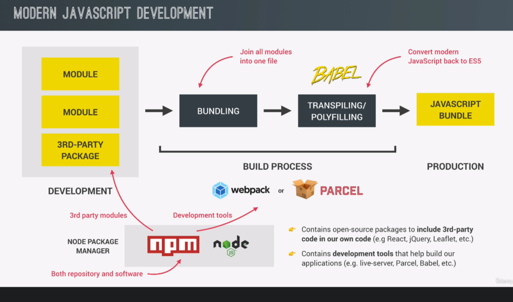
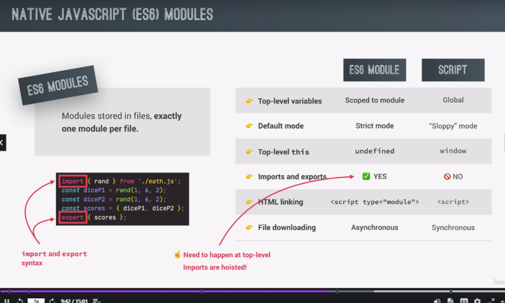
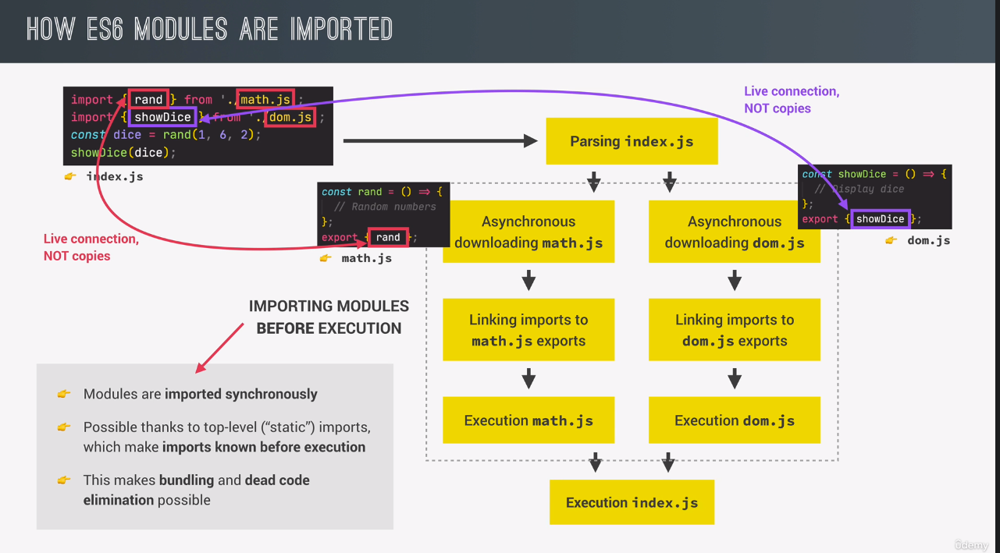

# Modern


## Overview



## Modules





## Exporting and Importing in ES6 Modules

> Imports are live connection to exports

> Point at the same space in memory

### Named Exporting

```javascript
// Exporting module
console.log("Exporting module");
const shippingCost = 10;
const cart = [];
// variables are scoped to this module.
export const addToCart = function (product, quantity) {
  cart.push({ product, quantity });
  console.log(`${quantity} ${product}`);
};
// named export
const totalPrice = 111;
const totalQuantity = 100;
export { totalPrice, totalQuantity as tq };
```

### Named Importing

- 1.

  ```javascript
  import "./shoppingCart.js";
  import { addToCart, totalPrice as price, tq } from "./shoppingCart.js";
  console.log("Importing module");
  addToCart("bread", 5);
  console.log(price, tq);
  ```

- 2.

  ```javascript
  console.log("Importing module");
  import * as ShoppingCart from "./shoppingCart.js";
  ShoppingCart.addToCart("bread", 5);
  ```

### Default Exporting & Importing

```javascript
export default function (product, quantity) {
  cart.push({ product, quantity });
  console.log(`${quantity} ${product}`);
}
// Give the export whatever name you like
import add from "./shoppingCart.js";
add("pizza", 2);
```


## Top-Level await (ES2022)

> We can now use `await` keywork outside an async Function. (Only works in modules => `html: type=module`)

> This superpower will block the entire module! Use it with great caution.

> If top-level await exists in exporting module, It will block any importing module which import it.

- Example 1: Blocking Way

  ```javascript
  const res = await fetch(`https://jsonplaceholder.typicode.com/posts`); // Fake Data RESTapi
  const data = await res.json();
  console.log(data);
  console.log("End fetching"); // Blocked until end fetching
  ```

- Example 2: More real-world Way

  ```javascript
  const getLastPost = async function () {
    const res = await fetch(`https://jsonplaceholder.typicode.com/posts`);
    const data = await res.json();
    return { title: data.at(-1).title, text: data.at(-1).body };
  };
  const lastPost = getLastPost();
  console.log(lastPost);
  // Not very clean
  lastPost.then((last) => console.log(last));
  // Using Top Level await
  const lastPost2 = await getLastPost();
  console.log(lastPost2);
  ```


## The Module Pattern (Which is old School)

> This is all because closures.

> This pattern has been existed long before ES6.

> In this pattern if we want multiple this closuer Moudule we have to link multiple js file in the html. In that way we have to be careful the order. Even worse we can't use bundler.

```javascript
const ShoppingCart2 = (function () {
  const cart = [];
  const shippingCost = 10;
  const totalPrice = 111;
  const totalQuantity = 23;
  const addToCart = function (product, quantity) {
    cart.push({ product, quantity });
    console.log(`${quantity} ${product}`);
  };
  const orderStack = function (product, quantity) {
    console.log(`Order ${quantity} ${product}`);
  };
  return {
    addToCart,
    totalPrice,
    totalQuantity,
  };
})();
ShoppingCart2.addToCart("apple", 5);
console.log(ShoppingCart2);
```

> `addToCart` was created in the IIFE which contains the `cart`, in this case `addToCart` still has the ability to access the `cart` Array which is privite.


