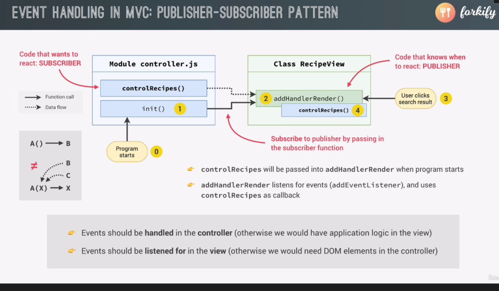

# Forkify2

## `config.js`

```javascript
// some var may be changed later
export const API_URL = "https://forkify-api.herokuapp.com/api/v2/recipes";
export const TIMEOUT_SEC = 10;
```

## `helpers.js`

```javascript
// contain functions we use over and over in our project.
// E.g. json()
import { TIMEOUT_SEC } from "./config.js";
const timeout = function (s) {
  return new Promise(function (_, reject) {
    setTimeout(function () {
      reject(new Error(`Request took too long! Timeout after ${s} second`));
    }, s * 1000);
  });
};

export const getJSON = async function (url) {
  try {
    const res = await Promise.race([fetch(url), timeout(TIMEOUT_SEC)]);
    const data = await res.json();
    if (!res.ok) throw new Error(`${data.message} (${res.status})`);
    return data;
  } catch (err) {
    throw err;
  }
};
```

## Event Handling in MVC: PUBLISHER-SUBSCRIBER PATTERN



> Reference: [Difference Between Pub-Sub Pattern and Observable Pattern](https://medium.com/easyread/difference-between-pub-sub-pattern-and-observable-pattern-d5ae3d81e6ce)

- Before: in `controller.js`

  ```javascript
  ["hashchange", "load"].forEach((ev) =>
    window.addEventListener(ev, controlRecipes)
  );
  ```

- In Pub-Sub Pattern: in `recipeView.js` and `controller.js`

  ```javascript
  class RecipeView {
    // add a new method
    addHandlerRender(handler) {
      ["hashchange", "load"].forEach((ev) =>
        window.addEventListener(ev, handler)
      );
    }
  }
  ```

  ```javascript
  const init = function () {
    recipeView.addHandlerRender(controlRecipes);
  };
  init();
  ```

## Error and Success Message

> We were loging err in model.js : `model.js:24 Error: Invalid _id: 5ed6604591c37cdc054bc886222333. (400) 😊😊😊😊😊`

> It should really be handled in view.js

```javascript
// add new method to view
renderError(message) {
  const markup = `
  <div class="error">
    <div>
      <svg>
        <use href="${icons}#icon-alert-triangle"></use>
      </svg>
    </div>
    <p>${message}</p>
  </div>
  `;
  this.#clear();
  this.#parentElement.insertAdjacentHTML('afterbegin', markup);
}
```

- Throw 1 in `helper.js`

  ```javascript
  export const getJSON = async function (url) {
    try {
      const res = await Promise.race([fetch(url), timeout(TIMEOUT_SEC)]);
      const data = await res.json();
      if (!res.ok) throw new Error(`${data.message} (${res.status})`);
      return data;
    } catch (err) {
      throw err;
    }
  };
  ```

- Throw 2 in `model.js`

  ```javascript
  export const loadRecipe = async function (id) {
    try {
      const data = await getJSON(`${API_URL}/${id}`);

      const { recipe } = data.data;
      state.recipe = {
        id: recipe.id,
        title: recipe.title,
        publisher: recipe.publisher,
        souceUrl: recipe.source_url,
        image: recipe.image_url,
        servings: recipe.servings,
        cookingTime: recipe.cooking_time,
        ingredients: recipe.ingredients,
      };
      console.log(state.recipe);
    } catch (err) {
      throw err;
    }
  };
  ```

- Catch and Render in `controller.js`

  ```javascript
  const controlRecipes = async function () {
    try {
      const id = window.location.hash.slice(1);
      console.log(id);
      if (!id) return;
      recipeView.renderSpinner();

      // 1) loading recipe
      // loadRecipe is an async function, so here we heave to await for it.  One async function calling another async function
      await model.loadRecipe(id);

      // 2) rendering recipe using state OBj from model.js
      recipeView.render(model.state.recipe);
    } catch (err) {
      recipeView.renderError();
    }
  };
  ```

## Implementing Search Result - 1

- `Model.js`

```javascript
export const loadSearchResult = async function (query) {
  try {
    state.search.query = query;
    const data = await getJSON(`${API_URL}?search=${query}`);
    // console.log(data);
    // console.log(data.data.recipes);
    state.search.results = data.data.recipes.map((recipe) => {
      return {
        id: recipe.id,
        title: recipe.title,
        publisher: recipe.publisher,
        image: recipe.image_url,
      };
    });
  } catch (err) {
    throw err;
  }
};
```

- new view `searchView.js`

```javascript
class SearchView {
  #parentEl = document.querySelector(".search");

  getQuery() {
    const query = this.#parentEl.querySelector(".search__field").value;
    this.#clearInput();
    return query;
  }
  #clearInput() {
    this.#parentEl.querySelector(".search__field").value = "";
  }

  addHandlerSearch(handler) {
    this.#parentEl.addEventListener("submit", function (e) {
      e.preventDefault();
      handler();
    });
  }
}
export default new SearchView();
```

- `controller.js` Pub-Sub Pattern

```javascript
const controlSearchResults = async function () {
  try {
    // 1) Get search quer y
    const query = searchView.getQuery();
    if (!query) return;

    // 2) Load search results
    await model.loadSearchResult(query);

    // 3) Render results
    console.log(model.state.search.results);
  } catch (err) {
    console.log(err);
  }
};
const init = function () {
  recipeView.addHandlerRender(controlRecipes);
  searchView.addHandlerSearch(controlSearchResults);
};
init();
```

## Implementing Search Result - 2

- `resultsView.js`

```javascript
import View from "./View.js";
import icons from "url:../../img/icons.svg";
class ResultsView extends View {
  _errorMessage = `No recipes found for your query. Please try another one!`;
  _message = ``;
  _parentElement = document.querySelector(".results");

  _generateMarkup() {
    console.log(this._data);
    return this._data.map(this._generateMarkupPreview).join("");
  }
  _generateMarkupPreview(result) {
    return `
      <li class="preview">
        <a class="preview__link" href="#${result.id}">
          <figure class="preview__fig">
            
          </figure>
            <div class="preview__data">
              <h4 class="preview__title">${result.title}</h4>
              <p class="preview__publisher">${result.publisher}</p>
            </div>
        </a>
      </li>
    `;
  }
}

export default new ResultsView();
```

- `View.js`

```javascript
// import icons from '../img/icons.svg'; // Parcel 1
import icons from "url:../../img/icons.svg"; // Parcel 2

export default class View {
  _data;

  _clear() {
    this._parentElement.innerHTML = "";
  }
  renderSpinner() {
    const markup = `
  <div class="spinner">
    <svg>
      <use href="${icons}#icon-loader"></use>
    </svg>
  </div> 
  `;
    this._clear();
    this._parentElement.insertAdjacentHTML("afterbegin", markup);
  }

  renderError(message = this._errorMessage) {
    const markup = `
    <div class="error">
      <div>
        <svg>
          <use href="${icons}#icon-alert-triangle"></use>
        </svg>
      </div>
      <p>${message}</p>
    </div>
    `;
    this._clear();
    this._parentElement.insertAdjacentHTML("afterbegin", markup);
  }
  renderMessage(message = this._message) {
    const markup = `
    <div class="message">
      <div>
        <svg>
          <use href="${icons}#icon-smile"></use>
        </svg>
      </div>
      <p>${message}</p>
    </div>
    `;
    this._clear();
    this._parentElement.insertAdjacentHTML("afterbegin", markup);
  }
  render(data) {
    if (!data || (Array.isArray(data) && data.length === 0))
      return this.renderError(); // we have the default message, no need to pass one.
    this._data = data;
    const markup = this._generateMarkup();
    this._clear();
    this._parentElement.insertAdjacentHTML("afterbegin", markup);
  }
}
```

- `paginationView.js`

```javascript
import View from "./View.js";
import icons from "url:../../img/icons.svg";

class PaginationView extends View {
  _parentElement = document.querySelector(".pagination");
  _generateMarkup() {
    const numPages = Math.ceil(
      this._data.results.length / this._data.resultsPerPage
    );
    console.log(numPages);
    // Page 1, and there are other pages
    if (this._data.page === 1 && numPages > 1) {
      return `page 1, others`;
    }

    // Last page
    if (this._data.page === numPages && numPages > 1) {
      return `last page`;
    }
    // Other page
    if (this._data.page < numPages) {
      return `other pages`;
    }

    // Page 1, and there are NO other pages
    return `only 1 page`;
  }
}

export default new PaginationView();
```
