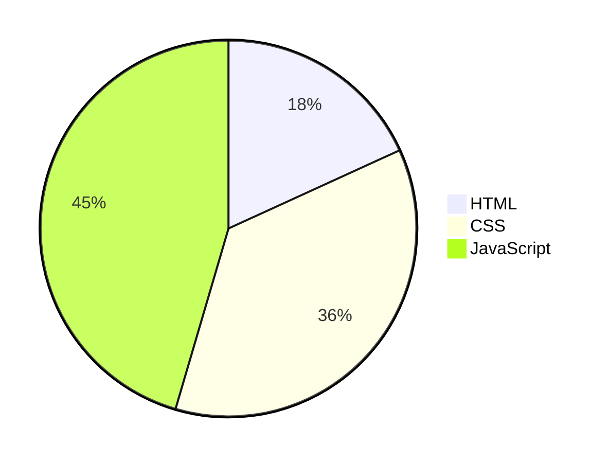
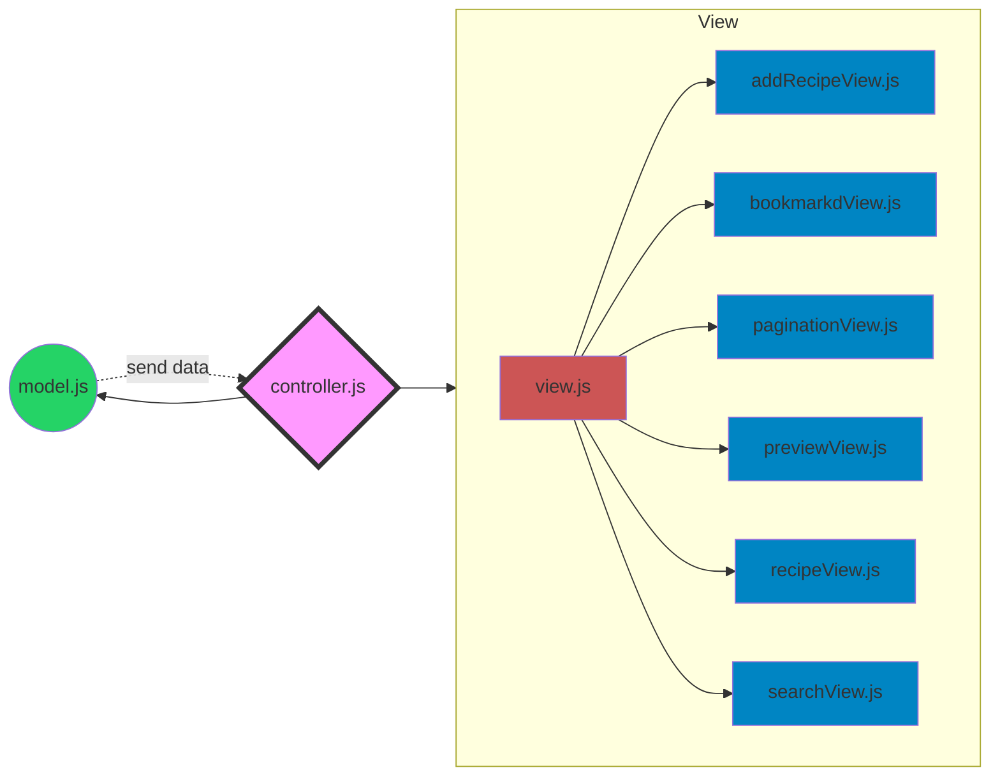

# Mermaid Playground

## Pie Chart

My skills

```mermaid
pie
"HTML" : 20
"CSS" : 40
"JavaScript" : 50
```

## Flow Chart

```mermaid
flowchart LR
  model.js((model.js)):::greenclass -.send data.-> controller.js{controller.js}
  controller.js{controller.js}:::orangeclass --> model.js
  controller.js{controller.js} --> View
  subgraph View
  direction LR
  view.js:::redclass --> addRecipeView.js:::dellclass
  view.js --> bookmarkdView.js:::dellclass
  view.js --> paginationView.js:::dellclass
  view.js --> previewView.js:::dellclass
  view.js --> recipeView.js:::dellclass
  view.js --> searchView.js:::dellclass
  classDef orangeclass fill:#f96;
  classDef redclass fill:#c55;
  classDef dellclass fill:#0085c3;
  classDef greenclass fill:#25d366;
  end

style controller.js fill:#f9f,stroke:#333,stroke-width:4px
```
